# V-Guard Sentinel

**Your inverter knows when the power goes. Sentinel knows what to do.**

V-Guard Big Idea Tech 2026 · Track 4 — *From Smart Products to Intelligent Products*
Team **Codey Tingle (TI3271)** · Ayush Garg · Eshan Shukla · Tanay Chaplot

---

## Demo videos

**Part 1 — Village Live simulation** (click to play the full video)

[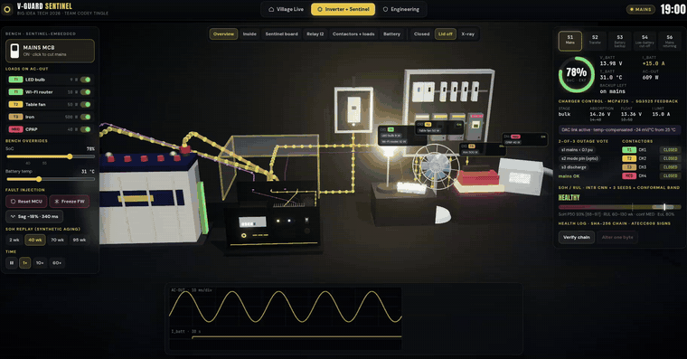](submission_final/demo.mp4)

**Part 2 — Inverter + Sentinel proof of concept** (click to play the full video)

[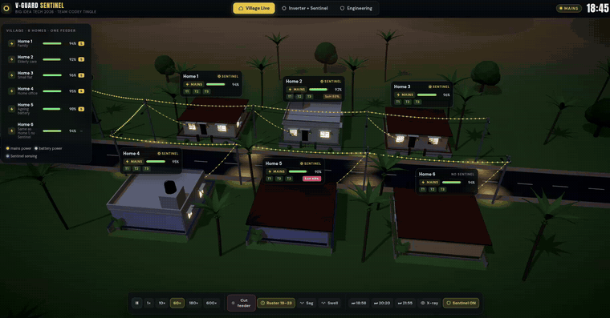](submission_final/demo_part2.mp4)

Interactive 3D simulation: download [`submission_final/Sentinel-Live.html`](submission_final/Sentinel-Live.html) and open it in Chrome or Edge (single self-contained file, works offline).

---

## The idea

85 % of Indian households face a power cut every day. When it happens, the home inverter just runs until the battery dies — no warning, no priorities. Lead-acid life halves for every +10 °C, and battery failures land on the manufacturer as warranty claims.

**Sentinel** is a small ESP32-S3 board that turns a smart inverter into an intelligent one. It predicts, decides and acts **on-device, with zero internet**.

| # | Job | What it does |
|---|-----|--------------|
| 1 | **Battery health** | Kalman filter + int8 CNN predicts a replacement *window* ("replace in 6–14 weeks"), never a fake date |
| 2 | **Habit autopilot** | Learns the home and sheds/defers loads during a cut so the fridge, router and lights stay on |
| 3 | **Energy Coach + Grid Shield** | NILM names the big appliances; power-quality engine logs every sag and swell |
| 4 | **Signed health log** | Tamper-evident hash-chained log, so warranty is decided by evidence |

Two SKUs, same core board:
- **Retrofit** — a box beside any inverter, 30-minute electrician fit (₹1,050 – ₹2,050 BOM)
- **Embedded** — daughter-board inside new V-Guard inverters, reuses the inverter's shunt, supply and enclosure, and can control the charger (₹450 – ₹1,300 BOM)

**Fail-safe by design:** loads sit on normally-closed contactors — *coil off = load on*. A hardware supervisory timer drops every coil if the firmware stops, so any crash or reset brings every load back.

### Key results (simulation data)

- **8.2 pt** SoH error on 3 never-seen test batteries; **+0.01 pt** lost going float → int8 (28 k params, 16 KB)
- Same outage, same battery: Home 6 (no Sentinel) sat **57 min** in the dark; Home 1's fridge, router and light were **never off**
- Grid Shield caught **13 / 13** dips; NILM found 123 switch events in 3 h (fridge F1 0.97)

---

## Architecture

**On-device AI architecture (offline-first)**

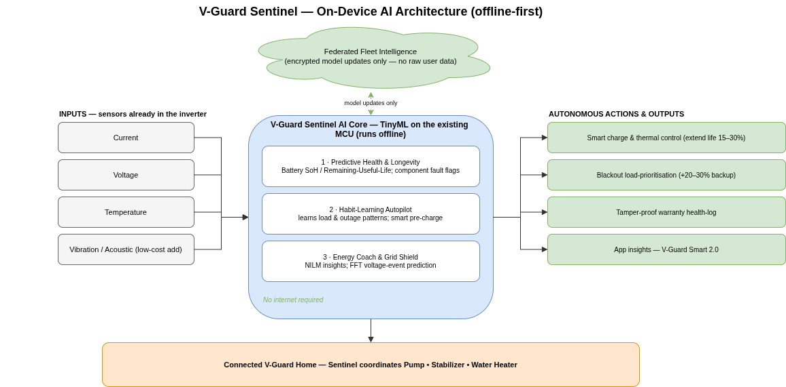

**Detailed system architecture**

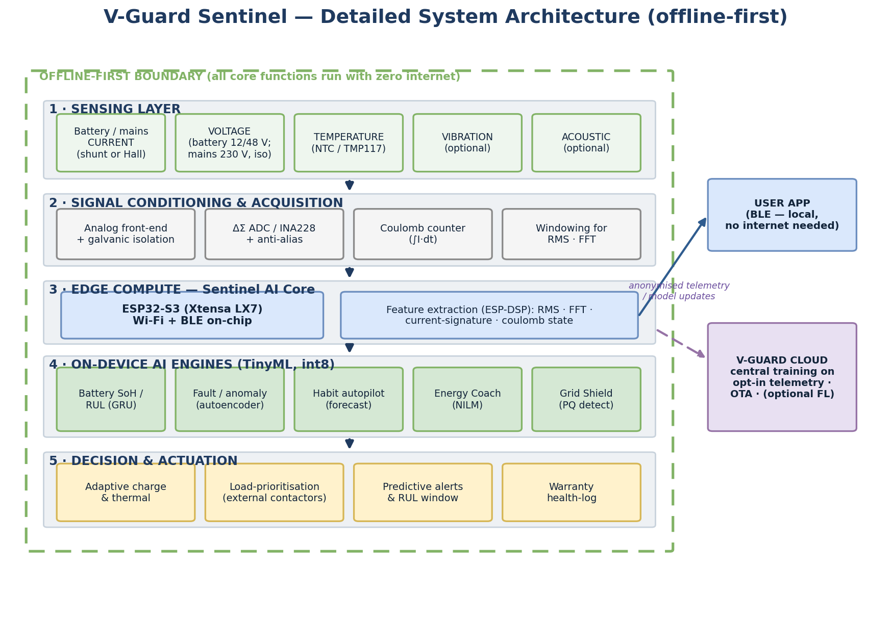

**Four jobs, one board**

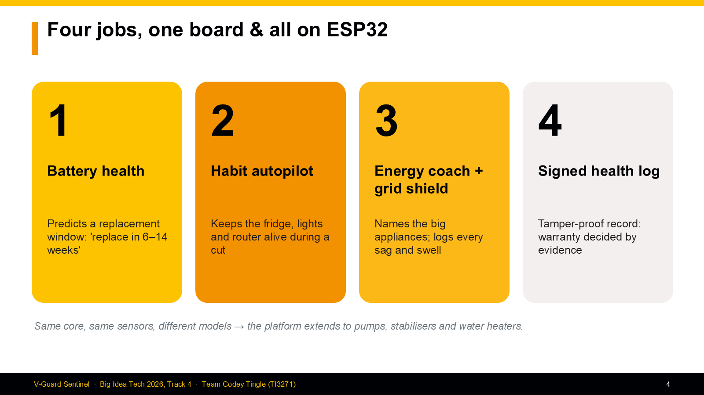

**Embedded SKU — what Sentinel taps inside the inverter**

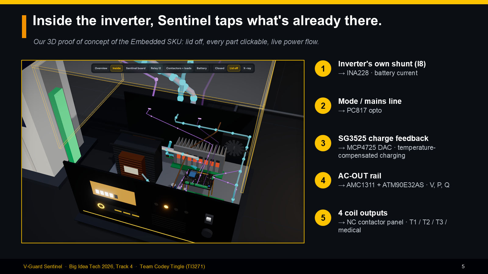

**Retrofit SKU — one small box reads the battery and switches the loads**

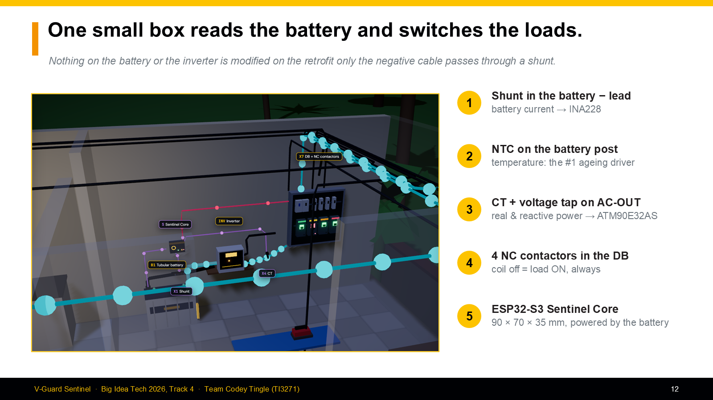

**Bench wiring**

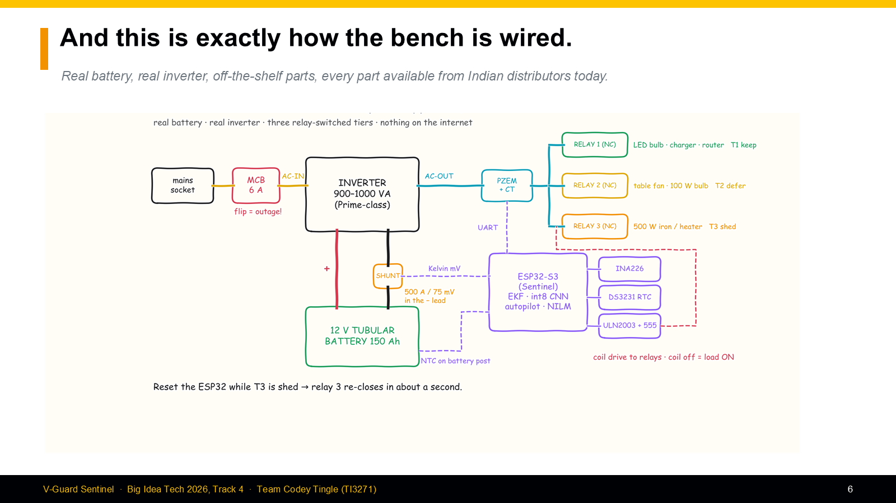

**Parts placement**

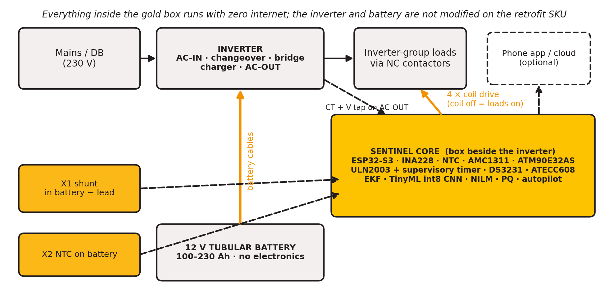

**Battery health pipeline — physics first, learning second**

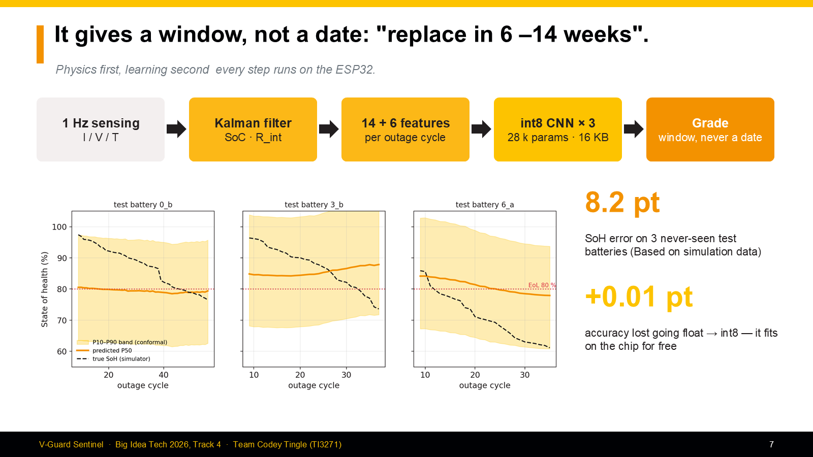

**Firmware tasks on the ESP32-S3 (dual core)**

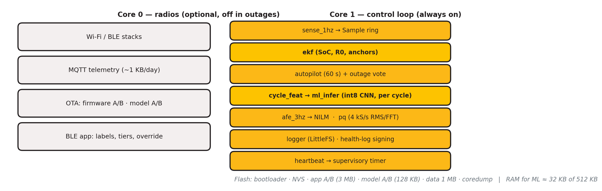

**Autopilot shed ladder**

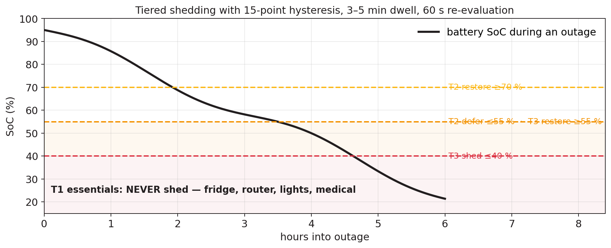

**Same outage, same battery**

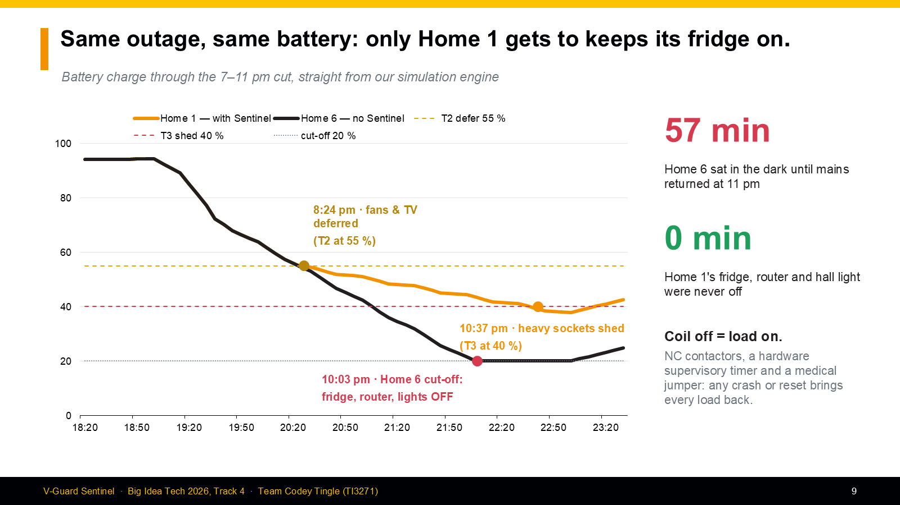

**Energy Coach + Grid Shield**

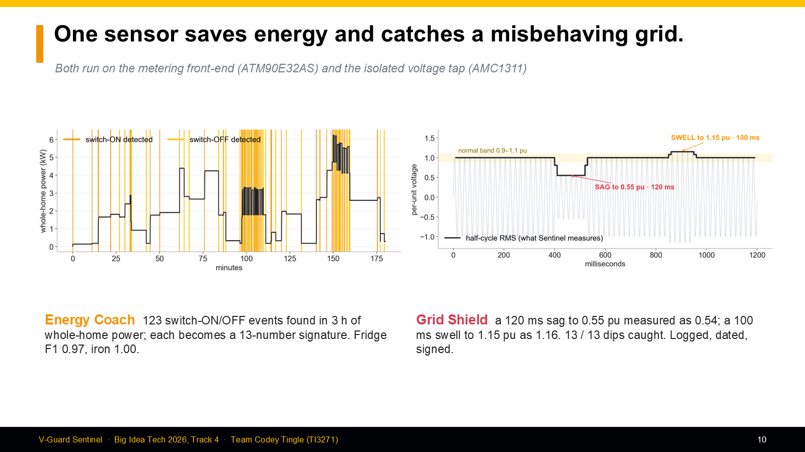

**Hardware — 90 × 70 × 35 mm, HV zone fenced off**

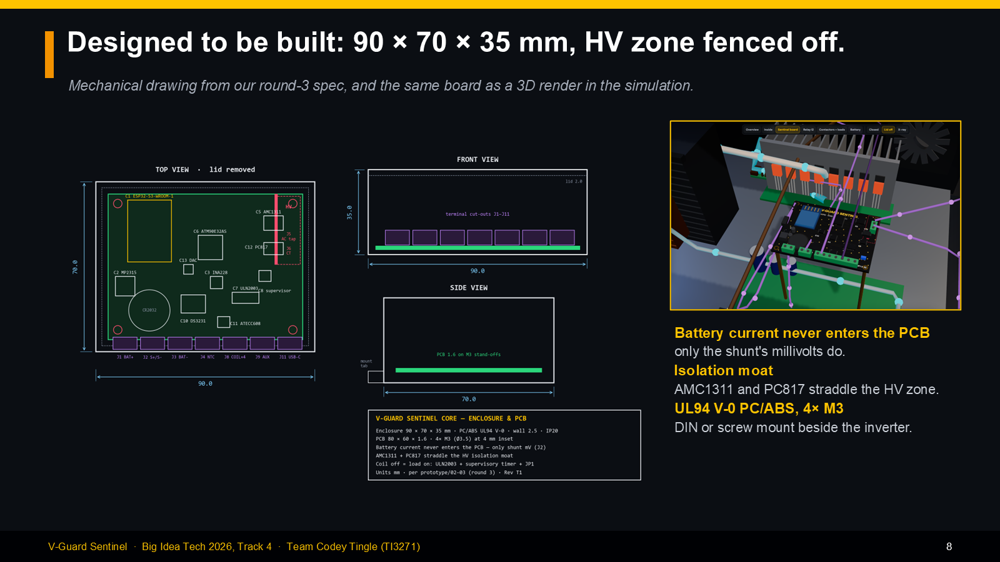

**Cost and value**

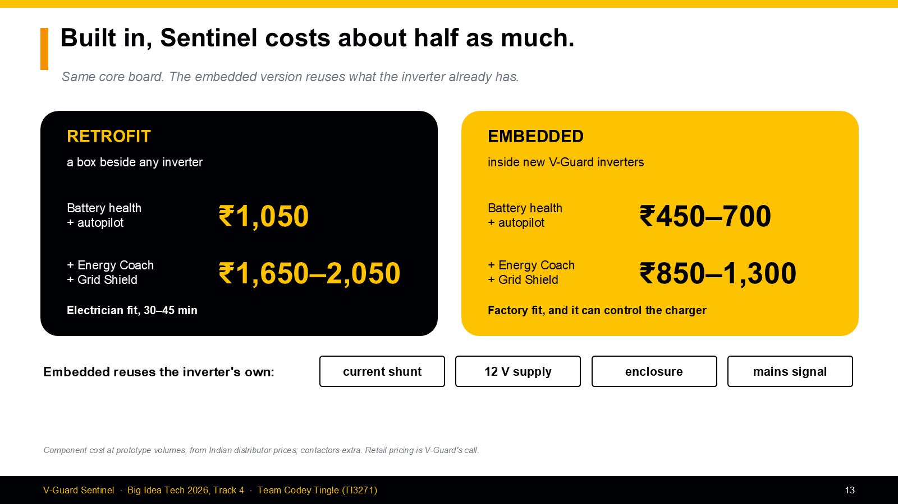

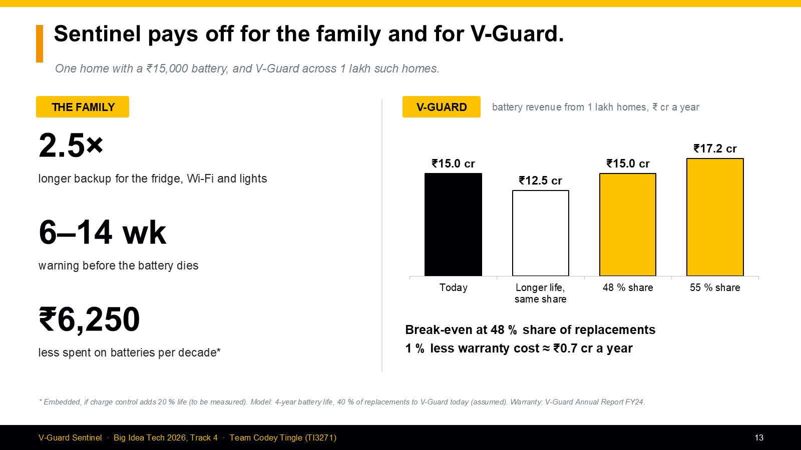

**Validation roadmap**

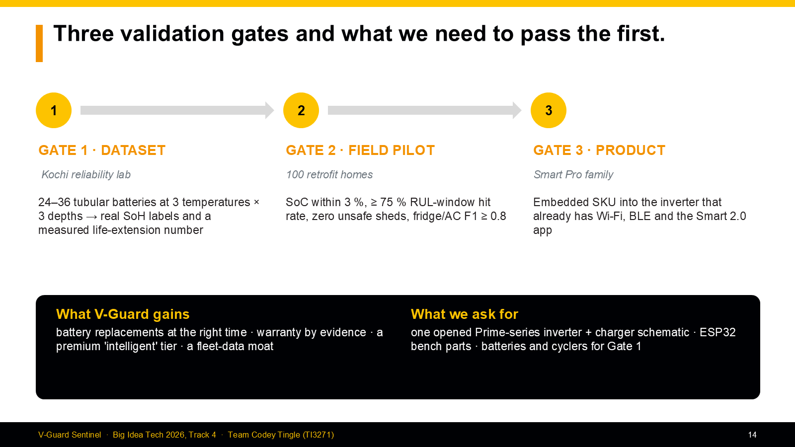

---

## Repository layout

```
submission_final/        Final deliverables: deck, demo videos, Sentinel-Live simulation
round 3_final/vguard-sentinel/
  prototype/code/        Runnable prototype: sim, features, EKF, model, autopilot,
                         NILM, PQ, health log, charger, dashboard, ESP32 firmware
  design/                Engineering design docs (00–13)
  prototype/             Product definition, parts, firmware, build plan, CAD
  deck/                  Deck builders and generated figures
  submission_v2/         Finale deck versions, Sentinel-Live source, prep material
round 2/                 Detailed report, diagrams, CAD, video
round 1/                 Executive summary
media/                   Images used in this README
```

## Run the prototype

```bash
cd "round 3_final/vguard-sentinel/prototype/code"
pip install -r requirements.txt
python -m pytest
```

Simulation source (React + Three.js):

```bash
cd "round 3_final/vguard-sentinel/submission_v2/sentinel-live"
npm install && npm run dev
```

Full deck: [`submission_final/VGuard_CodeyTingle_final_latest.pptx`](submission_final/VGuard_CodeyTingle_final_latest.pptx)
