# 01 · V-Guard Sentinel, explained end to end

> Read this first. It explains every part of the project in plain words, and after each part it gives the logic you would use to defend it. The source for each claim is named in brackets, e.g. `design/05 §4.2`, so you can open the original if a judge pushes.

---

## 0. The one-minute version (memorise this)

**The problem.** In most Indian homes the power backup is a V-Guard-type inverter plus a 12 V tubular lead-acid battery. The inverter switches over in under 10 ms, so it is fast. The battery, however, has **no electronics at all**. Nobody knows how much charge is left, how healthy it is, or when it will die. During a long evening outage it keeps powering everything, fans and TV included, until it cuts off, and then the fridge, the Wi-Fi and the lights die together. Batteries also age fastest in heat, and India is hot.

**Our idea.** Sentinel is a small ESP32-S3 module. It **measures** the battery (current, voltage, temperature) and the inverter's AC output (voltage, current, real and reactive power). It **thinks** on the chip, with a Kalman filter, a tiny int8 neural network and rule engines. It **acts** through fail-safe contactors in the distribution board and, on new inverters, through the charger. Nothing depends on the internet.

**It has four jobs.**
1. Battery health: *"replace within 6–14 weeks"*. It gives a window, never a date.
2. Habit autopilot: during an outage it cuts non-essential circuits in tiers, so the fridge, router and a light last longest.
3. Energy Coach and Grid Shield: it recognises the big appliances and logs every voltage sag and swell.
4. Signed health log: a tamper-proof record, so warranty is decided by evidence.

**Two products, one board.** *Sentinel-Embedded* is a daughter-board inside new V-Guard inverters and can control the charger. *Sentinel-Retrofit* is a box beside any existing inverter, fitted by an electrician in 30–45 minutes; it advises on charging and protects the loads.

**Honesty line.** The code is real: 245 tests pass, the C modules match the Python ones, the int8 model is exported and self-tested. The battery-health accuracy is measured only on **synthetic** tubular data, because no real tubular aging dataset exists yet. That is exactly why the first gate is a battery aging campaign in V-Guard's Kochi reliability lab.

---

## 1. The ground truth: how an Indian home inverter system works

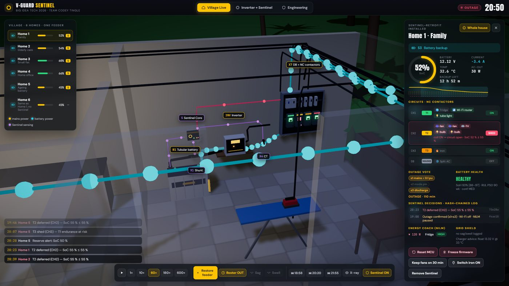
*The power corner of Home 1 in our simulation: tubular battery, shunt (X1), Sentinel Core, inverter, CT (X4) and the distribution board with the NC contactors (X7).*

### 1.1 The house wiring (`prototype/01 §1`)
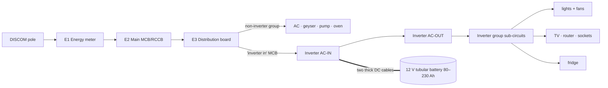
- When an electrician installs an inverter, they **split the DB** into an *inverter group* (lights, fans, TV, router, some sockets, often the fridge) and a *non-inverter group* (AC, geyser, pump). A 900–1000 VA inverter cannot run the heavy loads, so those are simply not wired through it. This is why the AC in our simulation goes off in an outage in every house.
- **Neutral** is common to both groups and **earth** is bonded to the inverter chassis.
- The **only DC current in the house** flows in the two battery cables, and that is where our shunt goes.

### 1.2 The inverter, state by state (`prototype/01 §3`)

| State | When | What happens | Time |
|---|---|---|---|
| **S1** Mains pass-through + charging | mains within the accepted window | AC-OUT = mains through the changeover relay; the charger charges the battery | continuous |
| **S2** Transfer | mains outside the window: UPS mode 180–260 V (±6 V), 47–53 Hz; Normal mode 90–290 V, 43–57 Hz | the bridge starts and the relay flips to the bridge | **< 10 ms** (V-Guard Prime spec) |
| **S3** Battery backup | — | the bridge draws from the battery: I ≈ P_load / (12 V × 0.85). 300 W is about 30 A | until mains returns or cut-off |
| **S4** Low-battery cut-off | ~10.5–10.8 V under load | output dead, buzzer | — |
| **S5** Overload | >110–120 % of rating | trips | ms |
| **S6** Mains return | mains stable for a few seconds | relay back to mains, charger resumes in bulk | seconds |
| **S7** Charging stages | — | bulk ≈ 10 % of Ah (15 A for 150 Ah) until 14.4 V → absorption 14.4 V → float 13.5–13.6 V | 8–12 h |

**Key insight to say out loud:** *the inverter is fast but blind.* It has a mains-sense circuit, a relay, an SG3525/TL494 **analog** PWM controller and a transformer. The charge setpoints are fixed by resistor dividers and a trim pot, and there is **no data bus**. The battery has **no electronics** at all.

### 1.3 Which signals exist, and which Sentinel adds (`prototype/01 §4`)

| Signal | On the battery? | On the inverter? | How Sentinel gets it |
|---|---|---|---|
| Battery voltage | at the terminals | internally | our own fused divider (J1) |
| **Battery current** | no | sometimes, internally | **our shunt in the − lead** (Retrofit) / Kelvin tap on the inverter's shunt (Embedded) |
| **Battery temperature** | no | no (the NTC is on the heatsink) | **our NTC on the battery post** |
| Mains present | no | internally | our AC sense + current sign (Retrofit), opto on the mode line (Embedded) |
| **AC output P, Q** | no | rarely | **CT + voltage tap on AC-OUT → metering chip** |
| Load per circuit | no | no | **our contactor channels** |
| Time of day | no | no | **our RTC** |

---

## 2. What Sentinel physically is (`prototype/02`, `prototype/03`)

### 2.1 The system boundary
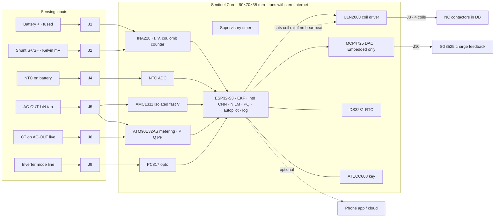

### 2.2 Every part and why it was chosen (`prototype/03 §1`)

| # | Part | Its job | Why this part (the defence) |
|---|---|---|---|
| C1 | **ESP32-S3-WROOM-1 N16R8** | the brain: sensing loop, EKF, feature pipeline, TinyML, NILM, PQ, autopilot, logging, radios | dual core at 240 MHz, 512 KB SRAM + 8 MB PSRAM, 16 MB flash (room for A/B firmware + A/B models). Its **vector (SIMD) instructions, used by ESP-NN**, make int8 CNNs 5–14× faster. Cheapest MCU with that plus a radio. *Not* an NPU; we corrected that wording (D16). |
| C2 | MP2315 buck | powers the board from the battery | 0.85 mA quiescent; 4.5–24 V input covers 12 V and 24 V systems; the module keeps working during outages |
| C3 | **INA228** 20-bit monitor | reads the shunt's millivolt drop (current) + battery voltage; hardware charge accumulator | ±1 µV offset ≈ 10 mA bias on a 0.1 mΩ shunt; 40-bit coulomb counter in silicon. (Bench Tier 0 uses the INA226 because INA228 breakouts are not sold in India.) |
| C4 | NTC input | battery temperature | temperature is the **#1 aging driver** in India and nothing else measures it on the battery |
| C5 | **AMC1311** isolated amplifier | fast (~4 kS/s) isolated sample of AC voltage → half-cycle RMS, zero-cross, outage, sag/swell | reinforced isolation; independent of the metering chip, so outage detection survives an AFE fault |
| C6 | **ATM90E32AS** metering AFE | true P, Q, S, PF, harmonics at 3 Hz on AC-OUT: the appliance-recognition signal | the ESP32's own ADC is not metering grade (INL ±8 LSB, no simultaneous V/I). This is a smart-meter chip (D1, D4). |
| C7 | ULN2003 | sinks 12 V contactor-coil current, 4 channels | 500 mA/channel with built-in flyback diodes; **coil off on reset** |
| C8 | Supervisory timer | if the ESP32 stops toggling a heartbeat pin for 2 s, it cuts all coils → all loads ON | hardware guarantee, independent of the firmware |
| C9 | Medical jumper JP1 | hard-wires one channel to "never energise" | the app cannot override a jumper |
| C10 | DS3231 RTC + CR2032 | time of day through outages | the ESP32's clock drifts when unpowered; habits and logs need real time |
| C11 | ATECC608 | per-device private key that never leaves the chip; signs the health log | warranty evidence needs a key that cannot be copied |
| C12 | PC817 opto | reads the inverter's mode / mains-present line | second vote for outage detection (s2) |
| C13 | MCP4725 DAC (Embedded only) | injects a small offset into the SG3525 feedback node → changes charge voltage | the *only* way to make an analog charger adaptive; hardware clamp on the inverter side |
| C14 | USB-C, LEDs, TVS | service, status, surge protection | — |

**Parts outside the box (Retrofit):** X1 busbar shunt 500 A / 50–75 mV in the battery negative lead · X2 NTC on the battery post · X3 fused BAT+ lead · X4 split-core CT on the AC-OUT live · X5 AC voltage tap · X6 optional mains CT for whole-home coaching · X7 contactor panel (2–4 × 25 A NC DIN contactors, 12 V coils).

### 2.3 Two SKUs, one core (`prototype/02 §3`, decision D2)

| | **Sentinel-Retrofit** | **Sentinel-Embedded** |
|---|---|---|
| Form | box beside the inverter | daughter-board inside the inverter |
| Battery current | external shunt in the − lead | Kelvin tap on the inverter's own shunt |
| AC sensing | CT on AC-OUT live + plug-in voltage tap | divider + isolator on the AC-OUT rail |
| Mains-present | own AC sense or current sign | control-board signal via opto |
| Charger | **advisory only** (no interface exists) | **controls it** via DAC on the PWM feedback node |
| Power | from the battery via the buck | from the inverter's 12 V rail |
| Install | electrician, 30–45 min | factory |

**Why two SKUs?** Because we checked, and a retrofit box **cannot command** an existing inverter's charger: the loop is analog, with no bus (design 03 §0). So we only claim life extension from smarter charging where we actually control the charger. Saying this openly is a strength.

### 2.4 The mechanical design
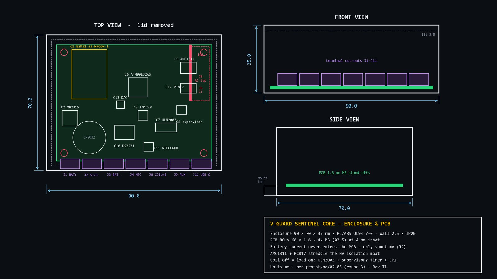
- Enclosure 90 × 70 × 35 mm, PC/ABS **UL94 V-0** (flame-retardant), wall 2.5 mm, IP20 (indoor).
- PCB 80 × 60 × 1.6 mm, 4× M3 mounting holes.
- **The battery current never enters the PCB.** Only the shunt's millivolts do (J2). 30–60 A stays in the battery cable.
- **Isolation moat:** the mains-side (HV) sensing is fenced off. The AMC1311 and PC817 straddle the barrier, which is exactly what they are for.

---

## 3. A day in the life (`prototype/02 §5`)
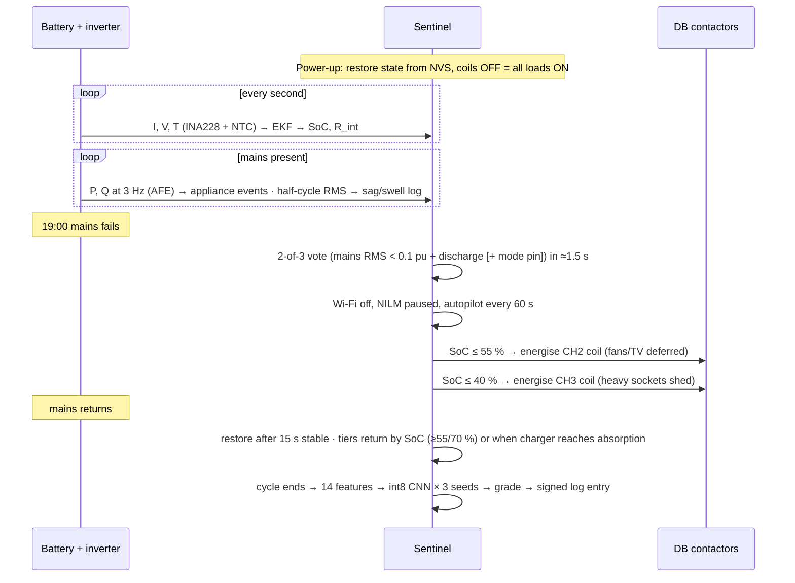

---

## 4. Engine 1: battery health (SoC, R_int, SoH, RUL)

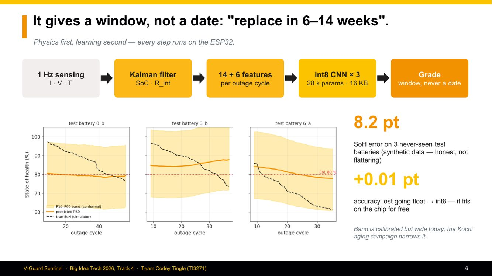

### 4.1 First, state of charge (SoC). Why a Kalman filter? (`design/01`)
- **Coulomb counting** (adding up the current over time) is simple, but small errors **drift**: a naive counter drifted about **7.2 %/week** in our test.
- **Open-circuit voltage (OCV)** tells you SoC, but only when the battery has *rested*, and lead-acid's OCV curve is **flat between 30 and 70 %**, where a few mV equals many % of SoC.
- An **Extended Kalman Filter (EKF)** fuses both. It predicts with coulomb counting and corrects with a voltage model of the battery.
- **Model**: a 1-RC Thevenin model. State = [SoC, V1 (polarisation), R0 (internal resistance)].
  - Why 1-RC, not 2-RC as in Li-ion? Lead-acid's slow effects are non-linear, and identifying two time constants from one noisy shunt + voltage pair is poorly conditioned.
  - Why R0 as a *state*? R0 moves about 40 % from full to empty and about 50 % with temperature, and it **rises with ageing**. Tracking it also gives a free health signal.
- **Result**: about **3 % RMS SoC error** vs 7.2 %/week for the naive counter (`prototype/code/ekf/README`, simulated battery).

### 4.2 The bug we found in our own report (D3, D17), a great story for judges
The round-2 report said *"re-anchor SoC to OCV during float-rest"*. **Float is not rest.** In float the charger is pushing current, so the terminal voltage = OCV + I·R0 + polarisation. That **over-reports SoC**. The fix:
1. **Full-charge anchor by current taper**: when the charger is ON and the charge current tapers below about 2 % of C, the battery is full. Victron shunt monitors work the same way.
2. **Rest-OCV only when the charger is verifiably OFF** and the battery has rested.

Then, *while building the code*, we found the per-tick voltage correction re-created the same bug during charging, so we gated it to charger-off (D17). *"We fixed it twice: once on paper, once when the code told us the paper was still wrong."*

### 4.3 From SoC to health: the features (`design/02 §1`)
After every outage cycle the ESP32 computes **14 dynamic + 6 static** numbers. The important ones are **ratios to the battery's own first-10-cycle baseline**, so every battery is compared with itself:

| Feature | Why it indicates wear |
|---|---|
| Resistance ratio R/R_baseline, and its slope | resistance growth **precedes** the capacity knee; the most transferable feature |
| Voltage-sag ratio under load | same physics, measured on real load steps |
| Ah throughput (Schiffer-weighted) | more deep cycles and more time at partial charge → faster sulphation |
| Depth-of-discharge histogram, time at low SoC | deep discharge and low-SoC dwell cause sulphation |
| **Arrhenius heat-stress integral** AF = exp(6400·(1/298 − 1/T)) | life **halves per ~+10 °C**; this counts "25 °C-equivalent days" |
| Coulombic efficiency | falls with sulphation and gassing (informative for lead-acid, useless for Li-ion) |
| Charge acceptance | declines with partial-state-of-charge cycling |
| dQ/dV peak shift during charging | sulphation shifts and flattens the peak |
| Rest-OCV vs EKF error | stratification hint |
| Statics | equivalent full cycles, total heat stress, age, fraction of deep cycles |

It takes 36 bytes per cycle, and the live feature state is under 12 KB of RAM.

### 4.4 The model (`design/02 §2`)
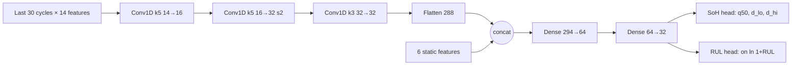
- **About 28 k parameters, about 106 k multiply-accumulates.** int8 → ~32–37 KB per model file. Three seeds are averaged.
- **Why a 1-D CNN, not a GRU?** TensorFlow Lite Micro has no native GRU kernel, ESP-NN does not accelerate recurrent ops, and int8 recurrent state accumulates error. A CNN uses exactly the ops ESP-NN speeds up (Conv 5.5–14×) and learns shape detectors (knee, trend, jump).
- **Why not an MLP on flattened data?** 420 inputs with position-specific weights cannot generalise "knee at cycle 20" vs "knee at cycle 25".
- **Speed:** roughly 1–10 ms per inference with ESP-NN, **once per outage cycle**. RAM for the ML subsystem is ~32 KB of 512 KB (16 KB tensor arena + interpreter, three seeds + anomaly model).

### 4.5 Why "a window, never a date" (D12)
- The heads output a median plus two **non-negative deltas**, so P10 ≤ P50 ≤ P90 always holds. No quantile crossing.
- **Three seeds** are averaged; if they disagree by more than 5 SoH points, the model is outside its experience, and the UI says *"uncertain — collecting data"*.
- **Split-conformal calibration** adds offsets computed on held-out batteries, which gives a statistical coverage guarantee.
- **Grades** (`design/02 §3.3`): Healthy (SoH ≥ 88 and RUL P10 > 26 wk) → Degrading → **Replace within N weeks** (SoH < 82 or RUL P10 < 8 wk; N = P10). A grade changes only after **3 inferences over ≥ 5 days**. Going back up is harder than going down.
- MC-dropout was rejected: it is not available in TFLM, needs 30–100 passes, and is poorly calibrated.

### 4.6 Training in three stages (`design/02 §4`)
- **Stage A**: pre-train on public Li-ion data (NASA, CALCE) for *shape* priors only.
- **Stage B**: a synthetic Indian duty simulator (outages, loads, heat, Peukert, sulphation).
- **Stage C**: fine-tune on V-Guard's own tubular aging campaign (freeze conv layers first, then fine-tune gently).
- Validation uses **GroupKFold by battery**, never a split inside one battery, plus leave-one-condition-out. There is a leakage test in code.
- The executed ablation (synthetic → synthetic) showed that pre-training cut SoH MAE from **16.4 to 10.5 points**.

### 4.7 The honest results (`prototype/00`, `model/artifacts_sim/metrics.json`)

| Metric | Result | How to explain it |
|---|---|---|
| SoH MAE / RMSE | **8.2 / 9.6 points** | on 3 test batteries never used for training, selection or calibration, **synthetic** |
| 80 % band coverage | 0.66 → **0.99** after conformal | calibrated, but the band is **wide** (~34 points) |
| RUL window hit rate | 1.00 (n = 3) | tiny sample; the target in the field is ≥ 75 % |
| Median warning lead | 4.4 weeks | target ≥ 8 weeks after the campaign |
| int8 vs float | **+0.013 points** MAE | quantisation is practically free |
| Target after the campaign | MAE ≤ 3 points | `design/11` |

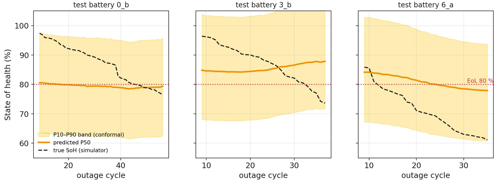
*Orange = predicted P50, yellow = P10–P90 band, dashed = true SoH from the simulator, red dotted = end of life at 80 %.*

---

## 5. Engine 2: the habit autopilot and load prioritisation (`design/05`)

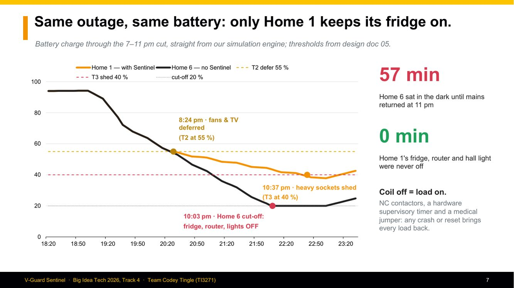

### 5.1 What it learns
- **A 7 × 24 table (168 bins)** of average load and outage probability by hour of week, updated with an **EWMA** (α = 0.08, about a 3-week memory). There are 4 seasonal copies (summer, monsoon, winter, pre-monsoon).
- **Outage probability** uses Beta smoothing, p = (k+1)/(n+2), so one early outage never locks in 100 %.
- Memory is **about 4.7 KB**. There is no training pipeline, and a judge can read the table.
- **Why not a neural forecaster?** Single-home load is extremely noisy, and studies show simple statistical baselines stay competitive at household level. What is predictable is the *schedule*: DISCOM load-shedding rosters repeat by hour and weekday. An interpretable table matters for a safety-adjacent decision. *"We forecast the roster, not the storm."*

### 5.2 Detecting the outage: the 2-of-3 vote (`design/05 §7`)
- **s1**: mains RMS < 0.1 pu, sustained 1–2 s (AMC1311 fast path)
- **s2**: the inverter mode pin says "battery" (Embedded, via opto)
- **s3**: battery current turned to discharge (shunt)
- **Outage = s1 AND (s2 OR s3)**, or s1 alone for ≥ 5 s. One failed sensor cannot fake or miss an outage.
- **Restore** = mains > 0.9 pu for 10–30 s (we use 15 s), because grids often flicker when power comes back.

### 5.3 The shedding ladder (`design/05 §4.2`)

| Rule | Value | Reason |
|---|---|---|
| **T3** (heavy sockets) shed at | SoC ≤ **40 %** | lead-acid guidance: don't routinely go below ~40–50 % |
| T3 restore at | ≥ 55 % | 15-point hysteresis → no chattering |
| **T2** (fans, TV, room lights) defer at | SoC ≤ **55 %** | shed T2 before T3 becomes urgent |
| T2 restore at | ≥ 70 % | 15-point hysteresis |
| **T1** (fridge, router, a light) | **never shed** | essentials |
| **MED** (medical socket) | never shed, **hardware jumper** | cannot be overridden |
| Hard floor | shed T3 if available energy < **1.2 ×** the forecast T1 energy for the rest of the outage | protects essentials even above 40 % |
| Min OFF dwell | 3–5 min | compressor anti-short-cycle |
| Re-evaluate | every 60 s (and on outage events) | responsive without wearing contactors |
| Alerts | 50 / 35 / 20 % | inform, independent of shedding |
| User override | 30 min (max 4 h) | cannot beat the hard floor |

After mains returns, T2/T3 come back only when SoC reaches the restore level **or** the charger reaches absorption. A depleted battery is not asked to charge while also running heavy loads.

### 5.4 The honest limit
One contactor switches a whole circuit, so **granularity = the number of channels wired**. Inside the T1 circuit we alert and advise; we don't pretend to switch individual appliances. Smart plugs are roadmap.

### 5.5 Pre-charge before a predicted outage
If P(outage in the next 3 h) > 0.55 with confidence ≥ 0.5, the autopilot raises the SoC target by 15 points and tightens the thresholds by 10 points. On **Embedded** it commands the charger. On **Retrofit** it only sends an **advisory** ("scheduled-pattern outage likely 18:00–19:00, limit heavy loads now").

---

## 6. The fail-safe chain: "coil off means load on" (`design/05 §6`, D8)
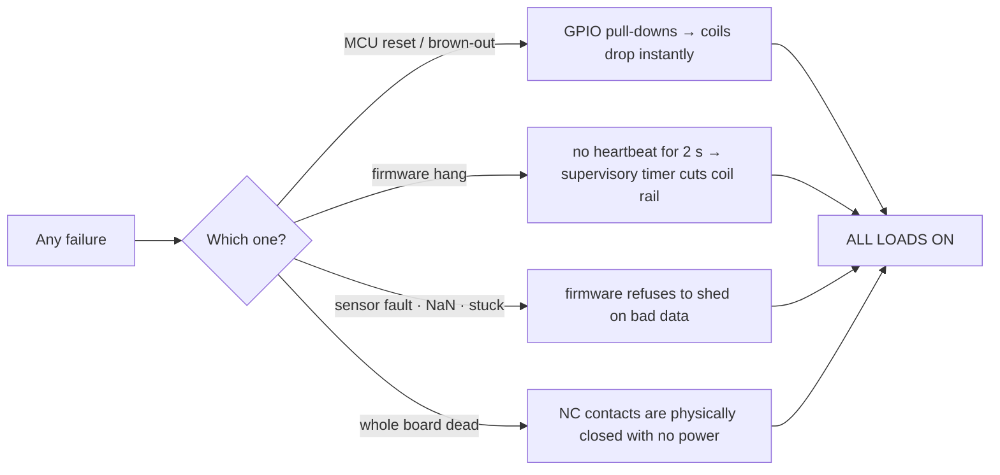
- **Normally-closed (NC) contactors**: the load circuit is *closed* when the coil has no power. "Shedding" means energising the coil to *open* it. Any power loss or crash puts every load back on. (Tesla's gateway uses the opposite convention; we explicitly chose NC.)
- **Latching relays rejected**: they would stay open after a crash.
- **Medical jumper**: one channel can never be energised, in hardware.
- **Stated trade-off**: after a crash, the compressor anti-short-cycle delay can't be enforced. We accept that because "never leave essentials dark" matters more.

---

## 7. Engine 3: Energy Coach (NILM) and Grid Shield (`design/06`, `design/07`)

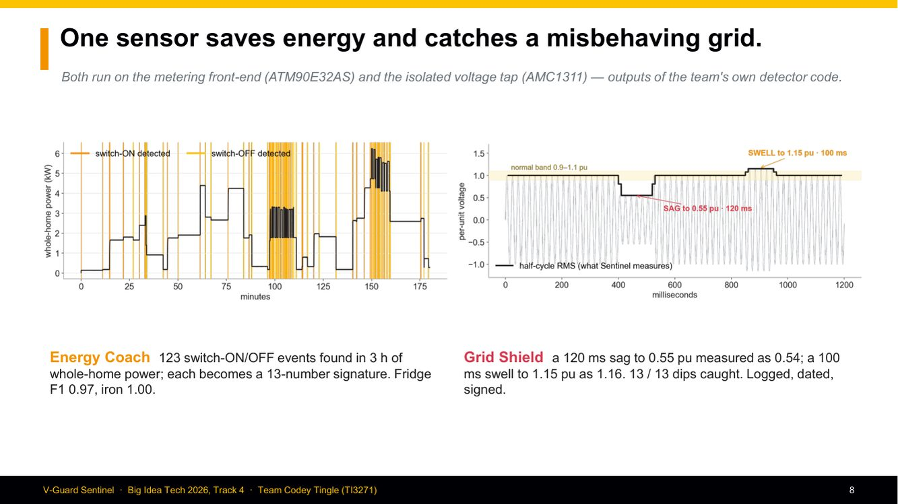

### 7.1 Why a battery shunt cannot see appliances (D1)
When mains is present, appliances run from mains through the inverter's relay; the battery current carries no load information. So we added a **metering chip + CT on the AC output**. That gives real power P and reactive power Q, which is the signature that tells a fridge motor (lagging PF, reactive power) from a heater (pure resistive).

### 7.2 How appliance recognition works
1. Detect a **step** in power: ΔP ≥ 25 W (or 2 % of the background), with debounce.
2. Build a **13-number signature**: ΔP, ΔQ, phase angle, inrush ratio, settling time, harmonic share, duration, periodicity, time of day, and more.
3. Match with **rules + k-NN** against a per-home library seeded with Indian appliance classes. The user names new clusters ("what just turned on?").
4. Pair ON with OFF to get duration and energy (kWh per appliance).

**Results (synthetic streams):** event recall 1.00, precision 0.74, fridge F1 0.97, iron 1.00, 87 % of energy assigned. **Honest scope:** big appliances (fridge, AC, geyser, pump, iron), not two identical fans, not loads under ~40 W.

### 7.3 Grid Shield: detect, don't predict
- Voltage is sampled at ~4 kS/s and the **RMS is refreshed every half cycle (10 ms)**. This is the IEC 61000-4-30 method.
- It is classified per **IEEE 1159**: sag 0.1–0.9 pu, swell > 1.1 pu, interruption < 0.1 pu, bucketed by duration.
- Every event is **dated and signed** in the log, which gives the owner evidence when a fluctuation damages an appliance.
- We claim **"Class-S-like"**, never certified Class A.
- **Results:** 13/13 dips detected, magnitude error ≤ 0.86 % (test set). In our demo chart the 0.55 pu sag was measured as 0.54 and the 1.15 pu swell as 1.16, within the validation target of ≤ 2 % of nominal (`design/11`).

---

## 8. Engine 4: the signed health log, security and OTA (`design/09`)
- **Record** = {monotonic counter, timestamp, event, hash of the previous record}. The records are **SHA-256 hash-chained** and each is **signed with ECDSA-P256** by a key generated *inside* the ATECC608, which it never leaves.
- A verifier with only the public key detects **tampering** (the hash breaks), **deletion** (a counter gap), **replay** (the counter must increase) and **truncation** (signed checkpoints).
- **Use**: a one-tap warranty claim. V-Guard checks the evidence, e.g. "no deep discharge below 20 % more than N times, temperature within band". Warranty is decided by evidence, not argument.
- **Secure Boot V2 + flash encryption**, and TLS 1.3 with mutual authentication to V-Guard's broker.
- **Firmware and models update separately (A/B slots).** A new model must pass a **golden self-test** (a built-in window with known outputs) or it rolls back. Rollout is in rings: 1 % → 10 % → 50 % → 100 %.
- **Privacy**: raw 1 Hz data never leaves the device; only ~48-byte per-cycle summaries are sent, with consent (DPDPA).

---

## 9. Adaptive charging: Embedded only (`design/03`)
- **Temperature compensation:** −24 mV/°C per 12 V battery (−4 mV/°C/cell, the Victron default), referenced to 25 °C. Hot battery → lower voltage (less water loss and corrosion); cold → higher (less sulphation).
- **Current derating** above 45 °C, **hard stop** about 58 °C.
- **Equalisation** only when ≥ 30 days have passed, sulphation signs are present, T < 40 °C and no outage is predicted. Water-loss guard.
- **Hardware ceiling**: the DAC injection has a clamp the software cannot exceed.
- **2-second heartbeat**: if Sentinel dies, the charger returns to factory setpoints.
- **The 15–30 % battery-life extension is a target**, to be *measured* in the campaign (compensated vs fixed charging at 40 °C). It is **not** a promise, and only for the Embedded SKU.

---

## 10. Power budget (`design/10 §5`, D9)
- Average battery-side draw ≈ **2.6 mA** for the basic board. It is a proposal to measure, stated honestly as "milliamps, not microamps". That is under a twentieth of the battery's own self-discharge (≈0.04 %/day of 150 Ah).
- The NILM mode adds about 13 mA for the metering chip, so the AFE is duty-cycled.
- In an outage: Wi-Fi off, BLE advertising every 5 s, NILM off, 1 Hz sensing kept.
- While shedding, each held coil draws +60–100 mA. That is still a net win, because the shed load drew far more.

---

## 11. Firmware and how TinyML actually runs (`prototype/04`)
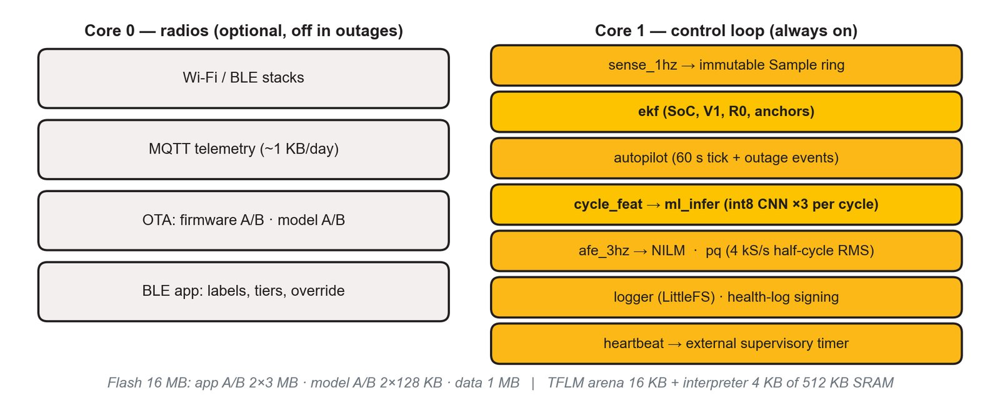
- ESP-IDF + FreeRTOS on two cores. **Core 1** always runs sensing (1 Hz), the EKF, the autopilot (60 s), the feature pipeline, ML inference, NILM, PQ and the logger. **Core 0** runs only the radios (optional).
- **The heartbeat task feeds the external supervisory timer only if every critical task has checked in.** Any hang → coils drop.
- **TinyML path**: Keras/PyTorch training offline → full-int8 post-training quantisation → `.tflite` (×3 seeds) + header (mean/scale, conformal offsets, schema version) → signed `model.bin` into a model slot → at boot, CRC + signature + schema check + golden self-test → at each cycle end: standardise → quantise → `Invoke()` (~1–10 ms) → dequantise → average the seeds → conformal band → grade → log.
- **No training on the device, ever.** Personalisation comes from ratio-to-own-baseline features and the conformal offset update.

---

## 12. Fleet learning: central now, federated later (`design/08`, D6, D15)
- **What is trained centrally:** the SoH/RUL model, on the aging campaign plus opt-in per-cycle summaries. There are no SoH labels on the device, so federated SoH learning doesn't make sense.
- **What *would* be federated:** the appliance classifier. That is where the labels live on the device (users naming appliances) and where the data is privacy-sensitive.
- **Federated learning is designed** (Flower, SecAgg, DP-FTRL, ε ≈ 4) but **deliberately cut from this prototype (D15)**. Say "designed, not built".

---

## 13. What is built vs what is not (`prototype/00-Status-Crosswalk.md`)

| Proven in code (executed here) | Synthetic only | Needs hardware / data |
|---|---|---|
| **245 tests pass** (autopilot 65, charger 48, health log 31, model 21, dashboard 19, …) | SoH 8.2 points MAE on simulated tubular batteries | flashing to an ESP32-S3 DevKit; TFLM latency on silicon |
| C modules (EKF, autopilot, NILM, PQ, health log, charger) match their Python references; autopilot 50/50 C scenarios | band calibrated (0.99 coverage) but wide | real bench: battery, shunt, CT, relays |
| int8 model exported, 3 seeds × 36.7 KB `.tflite`, bit-exact golden self-test in C | NILM / PQ numbers on synthetic streams | aging campaign → real SoH accuracy |
| firmware **host build** links the real C modules and feeds the dashboard | RUL hit rate on n = 3 | measured life-extension % |
| signed log catches tamper, delete, replay, truncation | — | ATECC608 provisioning, PCB layout |

---

## 14. Business: why V-Guard should care
- **Market** (research-market.md): Indian home UPS ≈ USD 348 M (2024) → 487 M (2030); inverter batteries ≈ USD 197 M → 346 M; lead-acid still ~53 % of the inverter-battery market.
- **V-Guard**: FY26 revenue ₹5,966 cr; Electronics ₹1,640 cr (+8.6 %, Q4 +22.3 %); ~100,000 retail touchpoints; ₹120 cr+ Kochi Innovation Campus with IoT and Reliability labs; in-house battery manufacturing; a stake in Gegadyne Energy.
- **Warranty**: ₹69.39 cr on ₹4,559 cr revenue in FY24 ≈ **1.52 %**. The failure causes brands cite to void warranty (dry-out, deep discharge, overcharge, heat) are **exactly the variables Sentinel measures**.
- **Cost** (D7): basic board ≈ ₹750 (Engines 1+2), ₹1,050 standalone with the shunt, ₹1,650–2,050 with the Coach kit. Embedded increment ₹450–700, or ₹850–1,300 with the Coach. That is **5–14 % of a ₹15 k battery**. (Contactors are extra.)
- **Value loop**:
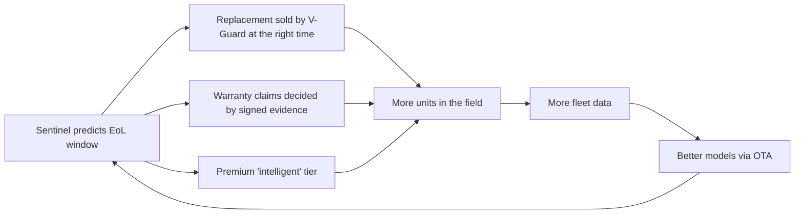

---

## 15. Why nobody has done this yet, and why V-Guard specifically can

**Why it hasn't been done:**
1. **The charger loop is analog.** Indian inverters use SG3525/TL494 controllers with resistor-divider setpoints. There is no bus to read or command. Anyone doing "smart" today adds telemetry around the edges.
2. **What competitors ship is telemetry, not intelligence.** Luminous Zelio Wi-Fi does status monitoring with no ML. Microtek Luxe Wi-Fi does remote control and timer reminders. Su-Kam and Havells have no app. Exide lead-acid batteries have zero telemetry. V-Guard's own Smart Pro / Li-Smart has the app and health display but **no predictive layer** (research-market.md §3). AI battery prediction exists only in academia and solar farms.
3. **No tubular lead-acid aging data exists publicly.** Everyone trains on Li-ion (NASA, CALCE). Without in-house aging data a SoH model is a guess. This is the hardest barrier.
4. **Cloud-first designs fail exactly when needed.** In an outage the router is usually dead too, so "smart" apps go blind. Ours is offline-first.
5. **Switching house circuits is safety-critical.** It needs a fail-safe chain (NC contactors, supervisory timer, medical jumper), not an app toggle.
6. **Cost.** A ₹6–9 k mass-market inverter can't carry a ₹5,000 add-on. The design has to hit ₹450–1,300 embedded.

**Why V-Guard can (the moat):**
- **It makes the inverter *and* the battery**, so it can co-design the model with the chemistry, run the aging campaign in its **own Kochi reliability lab** and open its own charger schematics. A third-party add-on company cannot do any of this.
- **Installed base + 100,000 retailers**: the retrofit SKU has a market on day one, and every unit feeds the fleet data.
- **Smart Pro already has Wi-Fi/BLE and the Smart 2.0 app**, so the Embedded SKU slots into an existing platform.
- **Data compounds**: every unit shipped makes the model better, and that is a moat competitors can't buy.

**What we specifically bring (design contributions):**
1. **Float ≠ OCV correction**: taper-based full anchor + rest-OCV only with the charger off (D3/D17).
2. **Ratio-to-own-baseline features + Arrhenius stress + partial-SoC time**: physics-first features that transfer across batteries.
3. **A window, never a date**: quantile heads + 3-seed ensemble + split-conformal + grade hysteresis.
4. **2-of-3 outage vote** that works on a retrofit without the inverter's cooperation.
5. **An auditable autopilot**: a 168-bin table + a hysteresis ladder + a hard endurance floor, not a black box.
6. **A fail-safe chain** where every failure mode ends in "all loads ON".
7. **One metering sensor for two features** (appliance coach + grid evidence).
8. **A signed, checkpointed health log** as the warranty instrument.
9. **Honest SKU split**: charger control only where it is physically possible.
10. **Federate the model that has labels (NILM), not SoH.**

---

## 16. The design decisions we took after building it (`design/12`), your credibility bank

| # | The report said | We found | Decision |
|---|---|---|---|
| D1 | NILM from the battery current | a battery shunt can't see appliances | add ATM90E32AS + CT on AC-OUT |
| D2 | adaptive charging for all | retrofit can't command the charger | split Embedded vs Retrofit |
| D3 | anchor SoC to OCV in float | float ≠ OCV | taper anchor + true-rest OCV |
| D4 | 128–256 samples/cycle on the ESP32 ADC | the ADC isn't metering grade | metering on the AFE |
| D5 | "prioritise within the essential circuit" | one contactor = one on/off | alerts and advice inside a circuit |
| D6 | federate "the models" | SoH has no device labels | federate NILM only |
| D7 | ₹500 board | the claims need more parts | honest cost by tier |
| D8 | "fail-safe" (unspecified) | needs a mechanism | NC + pull-downs + supervisor + jumper |
| D9 / D16 | "microamp draw", "neural accelerator" | really ≈2.6 mA, SIMD not NPU | corrected wording |
| D10 | time-of-day learning | no clock | DS3231 |
| D11 | signed log | needs a key store | ATECC608 |
| D12 | uncertainty unspecified | MC-dropout impractical | quantiles + ensemble + conformal |
| D13 | outage prediction | only rosters are predictable | pre-charge active only on Embedded, else advisory |
| D14 | "thermal profile" | needs specifics | derate > 45 °C, stop ~58 °C, gated equalisation |
| D15 | Flower simulation | team deferred FL | cut from the prototype |
| D17 | per-tick voltage update | re-creates the float bug | gate it to charger-off |

---

## 17. Glossary
| Term | Meaning in one line |
|---|---|
| SoC | state of charge: how full the battery is right now (%) |
| SoH | state of health: capacity now vs new (%); end of life = 80 % |
| RUL | remaining useful life, in cycles (EFC) converted to weeks with this home's outage rate |
| EFC | equivalent full cycles: total Ah discharged ÷ rated Ah |
| R_int / R0 | internal resistance; rises as the battery ages |
| EKF | Extended Kalman Filter: fuses the current count with a voltage model |
| OCV | open-circuit voltage; only meaningful after rest with no current |
| Float / absorption / bulk | charger stages: constant current → constant voltage 14.4 V → maintenance ~13.5 V |
| PSoC | partial state of charge: living below full, which causes sulphation |
| Sulphation | lead-sulphate crystals harden on the plates; the main lead-acid killer |
| Arrhenius | reaction rate (and wear) roughly doubles per +10 °C |
| Peukert | usable capacity drops at high discharge current |
| NILM | non-intrusive load monitoring: recognising appliances from one power meter |
| P / Q / PF | real power / reactive power / power factor |
| pu | per-unit: voltage ÷ nominal (230 V = 1.0 pu) |
| Sag / swell | a short dip below 0.9 pu / rise above 1.1 pu |
| NC contactor | normally closed: the circuit is ON when the coil has no power |
| TinyML / TFLM | machine learning on microcontrollers / TensorFlow Lite Micro |
| int8 quantisation | storing weights as 8-bit integers → 4× smaller and faster |
| Quantile heads | the model outputs P10, P50, P90 instead of one number |
| Conformal calibration | adds offsets from held-out data so the band's coverage is guaranteed |
| EWMA | exponentially weighted moving average: a running average that forgets slowly |
| Hash chain | each record contains the hash of the previous one; editing breaks the chain |
