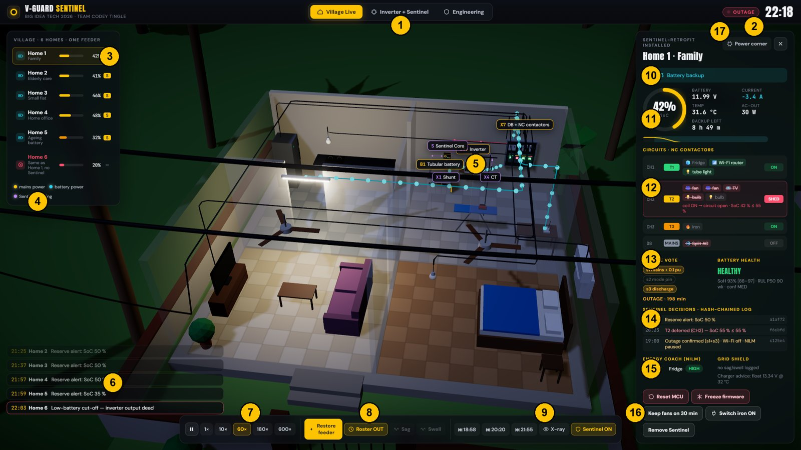
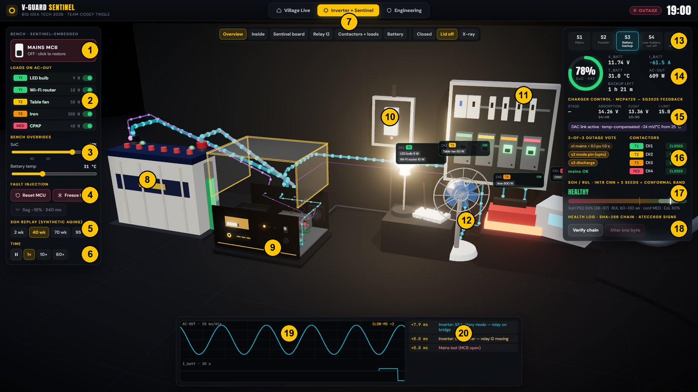

# 02 · Sentinel-Live simulation: complete user guide

> File: `submission_v2/Sentinel-Live.html`. It is **one self-contained file**: no internet, no install, no `node_modules`. Double-click it, open it in **Chrome or Edge**, press **F11**. Best at 1600×900 or larger.
> Every number in it comes from our design documents; the single source is `sentinel-live/src/sim/params.js`.
> Reload (**F5**) resets everything to the starting state. The app remembers which tab you last had open.

---

## 0. What the simulation is, and what it is not (say this if asked)

| It **is** | It is **not** |
|---|---|
| a physics + logic model of our design: inverter states S1–S6, battery charge/discharge, charger stages, the Sentinel firmware's outage vote, shed ladder, dwell, fail-safe, NILM events, sag/swell log, hash-chained log | running on real hardware; it is the design executed in software |
| thresholds, timings and part names taken from design/05, 03, 07 and prototype/01–05 | the trained EKF / CNN; the battery is a simplified equivalent-circuit model |
| real SHA-256 hash chaining | the ATECC608 ECDSA signature (shown, not computed) |
| battery-health grades that step through the dashboard fixture (`soh_replay_steps.json`, labelled "synthetic aging") | a measured battery-health result |

**One-liner:** *"This is our firmware logic running against a simulated house. The thresholds and timings are the ones in our design documents, and the separate Python/C codebase with 245 tests is where the real algorithms live."*

---

## 1. The three tabs
| Tab | What it shows | Use it for |
|---|---|---|
| **Village Live** | six Kerala homes on one feeder through an evening outage | the *story*: Home 1 vs Home 6 |
| **Inverter + Sentinel** | an inverter cut open with the Sentinel-Embedded board, on a Tier-0 bench | the *proof of concept*: millisecond transfer, shedding, fail-safe, charging, log |
| **Engineering** | system boundary, SKUs, engines, ladder, fail-safe, evidence, figures | backup if a judge wants theory without leaving the app |

The top-right always shows the **clock** and a **MAINS / OUTAGE** pill for the active tab.

---

## 2. Colour language (the same in both tabs)
| Colour | Meaning |
|---|---|
| 🟡 **Gold** particles | power coming from **mains** |
| 🔵 **Cyan** particles | power coming from the **battery** (backup), or the inverter bridge |
| 🟣 **Violet** particles/lines | **Sentinel sensing**: shunt, NTC, CT, mode line, DAC |
| 🔴 **Red** line / module | a **contactor coil is energised** = that circuit is OPEN (shed) |
| Particle speed | roughly proportional to the power flowing |
| SoC bar colour | green > 55 %, yellow 40–55 %, orange 25–40 %, red < 25 % |
| Tier colours | **T1** green = keep · **T2** yellow = defer · **T3** orange = shed · **MED** pink = never shed |

---

## 3. Village Live: every control and panel

| # | Element | What it is / what it means |
|---|---|---|
| 1 | **Tabs** | switch between Village, Inverter + Sentinel, Engineering |
| 2 | **Clock + MAINS/OUTAGE** | simulated time of day; the pill turns red and blinks during an outage |
| 3 | **Village roster** | one row per home: source icon (⚡ mains / 🔋 battery / ⊗ dark), name, SoC bar and %, and **S** if Sentinel is installed. Click a row to fly into that house. A dark house's name turns red. |
| 4 | **Legend** | gold = mains, cyan = battery, violet = sensing |
| 5 | **3D house (x-ray)** | roof lifted, walls ghosted. You see the appliances animate (fans spin, TV flickers, lights glow, fridge LED, router LEDs, iron plate glows, AC louvre) and the wiring with particles. Tags label the power corner: **B1** battery, **INV** inverter, **S** Sentinel Core, **X1** shunt, **X4** CT, **X7** DB + NC contactors. |
| 6 | **Event ticker** | the last 5 Sentinel decisions across the village, e.g. "20:23 Home 1 T2 deferred (CH2) — SoC 55 % ≤ 55 %". Click one to jump to that house. |
| 7 | **Play/Pause + speed** | 1×, 10×, 60× (default), 180×, 600× = simulated seconds per real second. At 60×, one minute passes per second. |
| 8 | **Feeder controls** | **Cut / Restore feeder** = manual outage · **Roster 19–23** = automatic scheduled outage 19:00–23:00 (it shows "Roster OUT" while inside the window) · **Sag** = a −18 % dip for 340 ms · **Swell** = +12 % for 220 ms (both only work while mains is on) |
| 9 | **Jump buttons + X-ray + Sentinel toggle** | ⏭ 18:58 / 20:20 / 21:55 fast-forward the *physics* to that time (not a cheat: the simulation actually runs in between) · **X-ray** lifts every roof · **Sentinel ON/OFF** removes or installs Sentinel on Homes 1–5 at once |
| 10 | **Inverter state** | S1 mains + charging (with the charger stage) · S3 battery backup · S4 low-battery cut-off · S6 mains returning |
| 11 | **SoC ring + telemetry** | SoC, battery voltage, current (− = discharging, cyan; + = charging, gold), temperature, AC-OUT watts, **backup time left** at the present load. The line under it is the SoC history (cyan band = outage; dashed lines at 55 / 40 / 20 %). |
| 12 | **Circuits · NC contactors** | CH1–CH4 with tier, appliances (green = powered, red strikethrough = wanted but cut), status **ON / SHED / DEAD**, and the reason ("coil ON → circuit open · SoC 42 % ≤ 55 %"). The **DB · MAINS** row is the non-inverter group (AC), which goes off in every outage. |
| 13 | **Outage vote + battery health** | s1 (mains < 0.1 pu), s2 (mode pin: greyed on Retrofit because it isn't wired), s3 (discharge). When confirmed: "OUTAGE · N min". The health grade comes from the replay fixture: HEALTHY / DEGRADING / Replace in 6–14 wk, with the SoH band and confidence. |
| 14 | **Sentinel decisions · hash-chained log** | time, message, and the first 6 hex characters of that record's SHA-256 hash |
| 15 | **Energy Coach + Grid Shield** | ▲/▼ appliance switch events with ΔP and confidence (HIGH ≥ 80 W, MED 40–80 W, LOW 25–40 W; < 25 W is not detected, honestly) · sag/swell entries · **charger advice** (the Retrofit only advises the temperature-corrected float voltage) |
| 16 | **Actions** | **Reset MCU**: pull-downs drop every coil → all loads back; reboot after 6 s, then outage re-detection → re-shed · **Freeze firmware**: heartbeat stops → after 2 s the supervisory timer cuts the coils; auto-recovery at 8 s · **Keep fans on 30 min**: user override (only when T2 is shed; it can't beat the hard floor) · **Switch iron ON**: forces the iron on (NILM event on mains) · **Remove / Install Sentinel** |
| 17 | **Power corner** | the camera flies to the battery/inverter/DB corner; press again for the whole house. ✕ returns to the village. |

**Camera:** left-drag rotates, right-drag pans, scroll zooms. Clicking empty space goes back to the village view.

### 3.1 The six homes (`src/sim/village.js`)
| Home | Story | Battery | Health | Special loads |
|---|---|---|---|---|
| **1 · Family** | our hero | 150 Ah, 12 V | SoH 93 % · HEALTHY | fridge, router, hall tube (T1) · 2 fans, TV, 2 bulbs (T2) · iron 19:15–19:35 (T3) · AC from 21:00 (mains only) |
| 2 · Elderly care | medical channel | 150 Ah | SoH 83 % · DEGRADING | **CPAP on the MED channel** from 21:30, never shed |
| 3 · Small flat | small battery | 100 Ah | SoH 95 % | smaller fridge (90 W) |
| 4 · Home office | bigger battery | 180 Ah | SoH 93 % | laptop on T1 |
| **5 · Ageing battery** | why RUL matters | 150 Ah | **SoH 68 % · Replace in 6–14 wk** | same loads as Home 1 → sheds much earlier |
| **6 · No Sentinel** | the control | 150 Ah | SoH 93 % | **identical to Home 1**, no Sentinel |

### 3.2 What happens on the default timeline (verified from the engine)
| Time | Event | Why |
|---|---|---|
| 18:40 | sim starts, sunset, mains on, windows light up | — |
| 19:00 | **roster outage**: every inverter → S3 in < 10 ms; street lights off; flows turn cyan; the AC goes off in every house | scheduled 19:00–23:00 |
| 19:00 (+1.5 s) | "Outage confirmed (s1+s3) · Wi-Fi off · NILM paused" in every Sentinel home | 2-of-3 vote, s1 debounced 1.5 s |
| 19:15–19:35 | irons on in Homes 1, 5, 6 (500 W) | the SoC falls fast |
| **19:46** | Home 5 **T2 deferred** at 55 % | ageing battery = less capacity |
| **20:07** | Home 5 **T3 shed — "T1 endurance at risk"** | hard floor: energy < 1.2 × forecast essential energy |
| **≈20:23** | Home 1 **T2 deferred** (bedroom dark, fans stop, TV off) | SoC 55 % |
| 20:39 / 21:03 / 21:24 | Homes 2 / 3 / 4 defer T2 | — |
| 21:30 | CPAP starts in Home 2 on the MED channel | never shed |
| **22:03** | **Home 6 → S4 low-battery cut-off: DARK** (fridge, router, lights all off) | no Sentinel; it burned everything |
| 22:25 / **22:37** | Home 2 / **Home 1 shed T3** at 40 % | ladder |
| 23:00 | mains back: S6 for 5 s → S1 + bulk charging; tiers **held** until SoC ≥ 55 / 70 % or the charger reaches absorption | recharge first |

**The punchline:** Home 6 is dark for **57 minutes** (22:03 → 23:00). Home 1's fridge, router and hall light were **never off**.

---

## 4. Inverter + Sentinel: every control and panel

**The bench** (prototype/05 Tier 0): a Prime-class inverter with the lid off, the Sentinel-Embedded daughter-board inside, a 12 V 150 Ah tubular battery (78 % at start, 31 °C), a mains MCB on the wall, a 4-channel NC contactor panel, and five loads. The clock starts at 19:00, speed 1× (real time).

| # | Element | What it does / means |
|---|---|---|
| 1 | **MAINS MCB** | click to cut or restore mains (the 3D MCB on the wall works too). Cutting it triggers **slow motion ×60** so you can *see* the 8 ms transfer. |
| 2 | **Loads on AC-OUT** | LED bulb 9 W (T1), Wi-Fi router 10 W (T1), table fan 50 W (T2), **iron 500 W (T3, starts OFF)**, CPAP 40 W (MED). The switch = whether the load *wants* power; green name = actually powered; red strikethrough = wanted but shed. |
| 3 | **Bench overrides** | **SoC slider** 20–100 % (a test hook that stands in for hours of drain; the autopilot re-evaluates immediately; marks at 40 and 55) · **Battery temp** 15–60 °C (drives the charger compensation and derating) |
| 4 | **Fault injection** | **Reset MCU** (coils drop instantly, the charger reverts to factory, reboot after 6 s) · **Freeze FW** (heartbeat missing → 2 s → supervisor cuts the coils) · **Sag −18 % · 340 ms** (mains must be on) |
| 5 | **SoH replay** | 2 wk = COLLECTING · 40 wk = HEALTHY · 70 wk = DEGRADING · 95 wk = **Replace within 6 weeks (6–14)**. Synthetic aging from the fixture, labelled as such. |
| 6 | **Time** | pause / 1× / 10× / 60× |
| 7 | **View presets + casing** | Overview · Inside · Sentinel board · Relay I2 · Contactors + loads · Battery · casing **Closed / Lid off / X-ray** |
| 8 | **Battery (B1)** | tubular, 6 vent plugs, float indicators, SoC gauge bar on its side; the NTC probe (X2) is on the − post |
| 9 | **Inverter cutaway** | I5 transformer (copper windings), I4 MOSFET bridge + heatsink (the MOSFETs glow with current), I10 fan, I3 control board with the SG3525, I1 mains sense, **I2 changeover relay** (transparent; the armature swings on transfer), I8 internal shunt, I11 front panel (LCD, LEDs), and the **Sentinel board on gold standoffs** |
| 10 | **MCB (wall)** | the lever moves; its LED is green (on) or red (off) |
| 11 | **NC contactor panel (X7)** | 4 modules; window green = closed (load on), red = coil energised (open); coloured strip = tier |
| 12 | **Loads + tags** | lamp (with real light), router (blinking LEDs), table fan (spins, oscillates), iron (plate glows orange), CPAP. The tag shows CHx, tier, ON/SHED/OFF, and clickable load names. |
| 13 | **Inverter state machine** | S1 mains · S2 transfer · S3 battery backup · S4 low-battery cut-off · S6 mains returning (the active one glows). *(S5 overload isn't modelled.)* |
| 14 | **Battery telemetry** | SoC (EKF label), V_batt, I_batt, T_batt, AC-OUT W, backup time left |
| 15 | **Charger control · MCP4725 → SG3525** | stage (bulk/absorption/float), **absorption and float setpoints with the factory values struck through** (14.40 / 13.50), I limit, derate %; "DAC link active · temp-compensated −24 mV/°C", or "Heartbeat lost → reverted to factory" |
| 16 | **2-of-3 vote + contactors** | s1 (with a countdown while debouncing), s2 (mode pin via opto: live on Embedded), s3; "OUTAGE · detected in 1.50 s"; CH1–4 CLOSED/OPEN |
| 17 | **SoH / RUL** | grade, a band bar with P10–P90 (white band), P50 marker, and the 80 % end-of-life line |
| 18 | **Health log** | the last 5 records with ms timestamps and hashes · **Verify chain** → "✓ N records verify" · **Alter one byte** → "✗ chain broken" (the altered row turns red) · **Undo** |
| 19 | **Scope** | **top:** AC-OUT voltage waveform, 10 ms/div, triggered. Gold = from mains, **cyan = from the inverter bridge**, **flat red = no output (the 8 ms transfer gap)**. "SLOW-MO ×N" while slowed. **Bottom:** battery current over the last 30 s (+ gold charging, − cyan discharging). |
| 20 | **Timeline** | events with **milliseconds after the last mains change**: "+0.0 ms Mains lost (MCB open)" → "+0.0 ms S2 transfer — relay I2 moving" → "+8.0 ms S3 battery mode" → "+1500 ms Sentinel: outage confirmed (s1+s2+s3)" → coil events |

**Hover** any part to see its ID and name; **click** it for a card explaining its role. IDs: **I1–I11** inverter parts (prototype/01), **C1–C14** Sentinel board parts (prototype/03), **X2** NTC, **X4** CT, **X7** contactor panel, **B1** battery, **MCB**.

### 4.1 Useful numbers you will see on the bench
- Bench loads with the iron on ≈ 609 W on AC-OUT → battery current ≈ **−61 A** ((609 + 5 W idle) ÷ 0.85 efficiency ÷ 11.7 V). Backup ≈ 1 h 20 min from 78 %.
- Charging at 31 °C: absorption **14.26 V** (factory 14.40) and float **13.36 V** (factory 13.50), because 6 °C above 25 °C × −24 mV/°C = −0.144 V. Bulk current = 10 % of 150 Ah = **15 A**.
- Battery temp 50 °C → current derated to ~62 % (linear from 45 °C to 0 at 58 °C).

---

## 5. Demo routes (pick one by the time you have)

### 5.1 The full 4-minute live demo (matches slide 12's notes)
1. **Village tab**, 180×. Click **⏭ 18:58**. At 19:00, point out the flows turning cyan and the street lights going out. *"Every inverter switched in under 10 ms."*
2. Click **Home 1** → **Power corner**. Point at B1, X1 shunt, S Sentinel, X4 CT, X7 contactors, then the vote panel (s1 + s3). *"Two-of-three vote, 1.5 seconds, no internet."*
3. **⏭ 20:20**: the bedroom goes dark and the fans stop (T2 deferred at 55 %). The fridge, router and hall light stay.
4. **✕**, then **⏭ 21:55**. Watch: at **22:03 Home 6's badge goes red: DARK**. Home 1 is still lit.
5. Click Home 1 → **Reset MCU**. All loads come back; after reboot it re-sheds. *"Coil off means load on."*
6. **Inverter + Sentinel tab.** Switch **Iron** on. Click **MAINS MCB**: slow motion; point at the relay swing, the scope gap and the timeline "+0 → +8 ms → +1500 ms".
7. Drag **SoC to 38 %** → CH3 turns red, the iron goes cold, and the fan is deferred. **Reset MCU** → everything comes back and the charger reverts to factory.
8. **Verify chain** → **Alter one byte** → broken → **Undo**. Back to the slides.

### 5.2 The 2-minute version
Village: ⏭ 18:58 → ⏭ 21:55 → show Home 6 DARK vs Home 1 lit → Bench: MCB cut (slow-mo) → SoC 38 % (iron sheds) → Reset MCU.

### 5.3 If a judge asks "show me X"
| Ask | Do |
|---|---|
| "What if the chip crashes?" | Village or bench → **Reset MCU**, then **Freeze firmware** (2 s supervisor) |
| "What about medical equipment?" | Home 2 → CPAP on **MED**, never shed; the jumper is C9 on the board (bench → Sentinel board view, hover JP1) |
| "What does the grid shield do?" | Village with mains on → **Sag** / **Swell** → Home panel → Grid Shield + log |
| "How does charging adapt?" | Bench, mains on → **Battery temp** slider 25 → 45 → 55 °C; watch the setpoints and the I limit |
| "Show the board" | Bench → **Sentinel board** view, hover C1 ESP32, C3 INA228, C5 AMC1311, C6 ATM90E32AS, C11 ATECC608, C13 DAC |
| "Show me the transfer in milliseconds" | Bench → MCB → scope + timeline |
| "What does the user override do?" | Village, a house with T2 shed → **Keep fans on 30 min** (logged; times out; can't beat the hard floor) |
| "Without Sentinel?" | Village → **Sentinel OFF**: every home behaves like Home 6 |
| "Battery health?" | Bench → SoH replay 2 → 40 → 70 → 95 wk |

---

## 6. Troubleshooting at the venue
| Problem | Fix |
|---|---|
| Blank 3D area after switching tabs | click another tab and back, or press F5 |
| Laggy | use 60× instead of 600×, turn X-ray off, close other apps; the laptop on mains power (not battery-saver) |
| You overshot a moment | F5 resets to 18:40; the jump buttons fast-forward only forward in time (a jump to an earlier clock time goes to the next day) |
| Mains stuck off after a manual cut | press **Restore feeder**, or **Roster** to hand control back to the 19–23 schedule |
| Bench confusion after many clicks | F5, then click the Inverter + Sentinel tab |
| No projector colour contrast | the night scene was brightened for projectors; if still dim, raise screen brightness and use the Power corner / bench close-ups |

**Never say:** "this is running on the ESP32" or "these are real battery measurements". **Say:** "this is our design executing in a simulation; the thresholds come from our design documents".
