# 03 · Demo: live simulation or video — speaking notes for both paths

> Slide 12 ("Let's watch it happen — live") is the hand-off. You have **~4 minutes** for the demo inside the 10-minute slot.
> **Path A**: the live simulation (`Sentinel-Live.html`); script in [02-Simulation-Guide §5.1](02-Simulation-Guide.md#51-the-full-4-minute-live-demo-matches-slide-12s-notes).
> **Path B**: the two recorded videos in `submission_v2/demoVideo/`, with the narration below.
> **Path C (recommended fallback)**: play both videos (~70 s), then do **one live action** (Reset MCU or the MCB cut). It keeps the "it's real and interactive" feeling at minimum risk.

## How to choose on the day
| Situation | Choose |
|---|---|
| Venue laptop runs the HTML smoothly (you tested it) and you have ≥ 4 min | **A**: live is more convincing for the 15-mark proof-of-concept criterion |
| Unknown laptop, weak GPU, projector lag, or time is short | **B**: videos, 70 s, zero risk |
| Laptop works but you're short on time | **C**: videos + one live click |

Both videos are silent screen recordings, so **you** are the narrator. They are short (34 s and 32 s), so **pause** at the marked points. A pause at the right frame lets the judges read the screen.

---

## Video 1 · `demo.mp4` (34 s): the Inverter + Sentinel bench
*What it shows: the Embedded proof of concept. Mains → cut the MCB → millisecond transfer → drain the battery with the SoC slider → tiers shed in order → the inverter's own low-battery cut-off at 20 %.*

| Time | On screen | Say (natural, ~1 sentence per beat) |
|---|---|---|
| **0:00–0:09** | 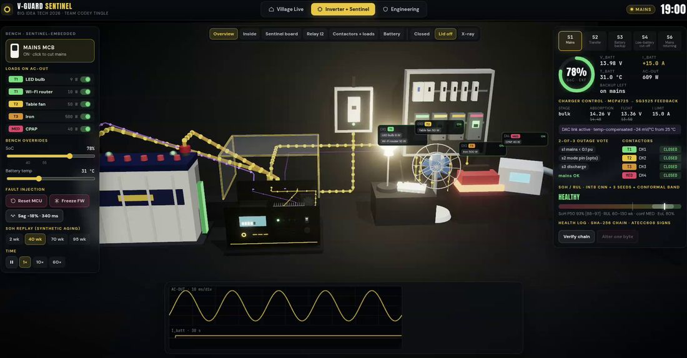 19:00, **S1 Mains** glowing, SoC 78 %, charger stage *bulk* with setpoints **14.26 V / 13.36 V** (factory 14.40 / 13.50 struck through), gold flow, every load on including the 500 W iron | "This is a V-Guard-class inverter with our Sentinel board inside, on a real bench layout: tubular battery, mains breaker, four normally-closed contactors and five loads. Mains is on, so the charger is in bulk, and Sentinel has already lowered the charge voltage by 144 millivolts because the battery is at 31 degrees, 6 above reference. The factory charger can't do that." |
| **0:10** ⏸ | 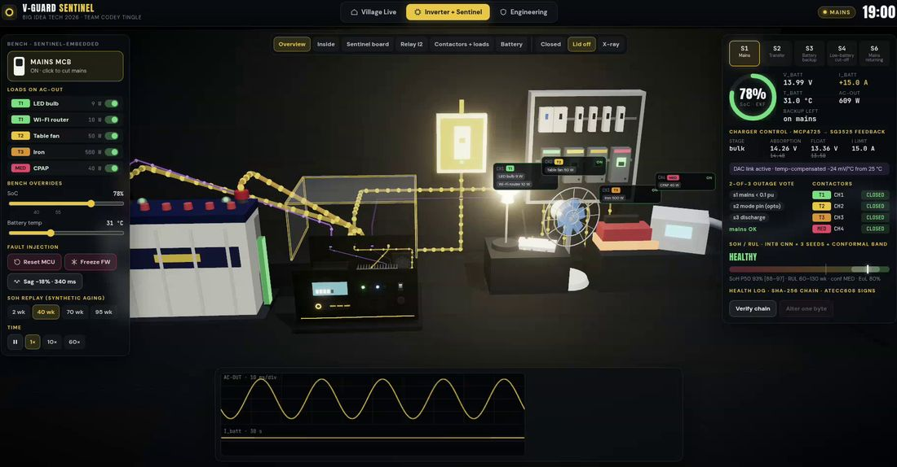 the MCB is clicked | "Now the power cut: I open the mains breaker." |
| **0:12–0:15** ⏸ | 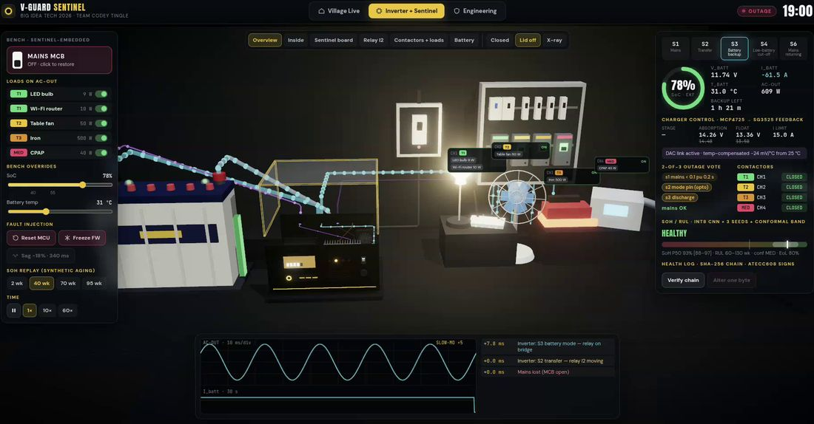 **S3 Battery backup**, flows turn **cyan**, scope waveform changes gold → cyan, timeline **+0.0 ms mains lost → +0.0 ms S2 transfer → +7.9 ms S3**, I_batt ≈ **−61 A** | "The inverter's relay swings to the bridge in 8 milliseconds. You can see it on the scope: the waveform switches from mains, gold, to the inverter, cyan. The battery is now supplying about 61 amps for 600 watts." |
| **0:16** |  vote panel: **OUTAGE · detected in 1.50 s** (s1 + s2 + s3); SoC slider being dragged | "One and a half seconds later Sentinel confirms the outage by a two-of-three vote: mains voltage, the inverter's mode line and discharge current. One broken sensor can't fool it. To save time I'm now fast-forwarding the battery with the bench SoC slider, which stands in for hours of drain." |
| **0:18–0:21** ⏸ | 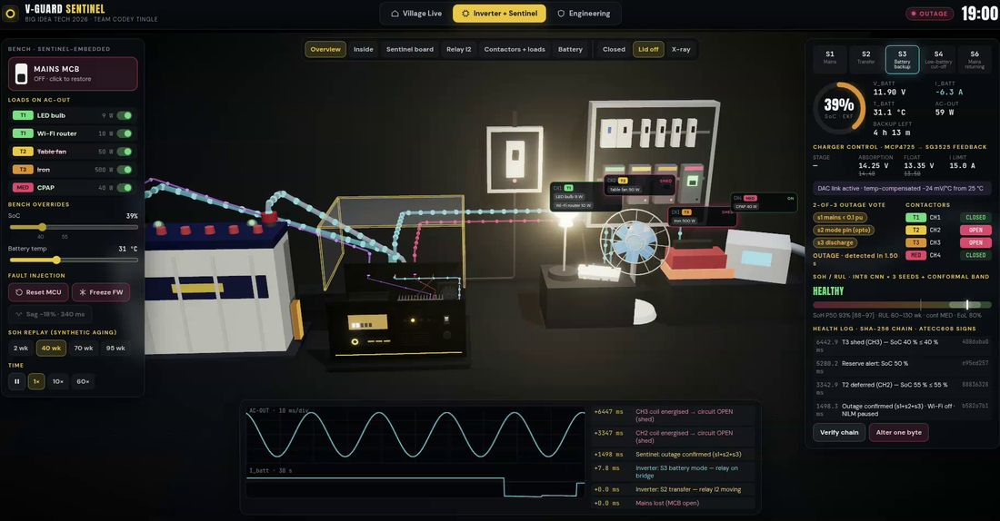 SoC 53 → 42 %: **CH2 (T2) turns red, the fan stops** | "At 55 percent the fan circuit, tier two, is deferred. The coil is energised, so the circuit opens. The lamp, the router and the medical socket stay on." |
| **0:22–0:24** ⏸ |  SoC 36 %: **CH3 (T3) red, the iron goes cold** | "At 40 percent the heavy socket, the iron, is shed. Essentials first, always." |
| **0:26–0:34** ⏸ | 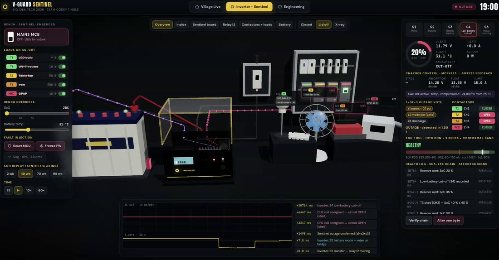 SoC 20 %: **S4 Low-battery cut-off**, everything dark, the scope flat | "And if you keep draining, at 20 percent the inverter's own low-battery cut-off protects the battery from deep discharge. Sentinel can't create energy; what it does is make that moment arrive as late as possible for the fridge, the router and the medical load. You'll see that effect in the village next." |

**If asked about the slider:** *"The SoC slider is a bench test hook. The real firmware reaches those levels by coulomb counting over hours; we compress the hours so you can see the ladder in 20 seconds."*

---

## Video 2 · `demo_part2.mp4` (32 s): the village, same outage, six homes
*What it shows: six homes on one feeder. X-ray view. The 19:00 roster outage. Homes with Sentinel shed in tiers; Home 6 (identical to Home 1, no Sentinel) goes dark at 22:03.*

| Time | On screen | Say |
|---|---|---|
| **0:00–0:02** | 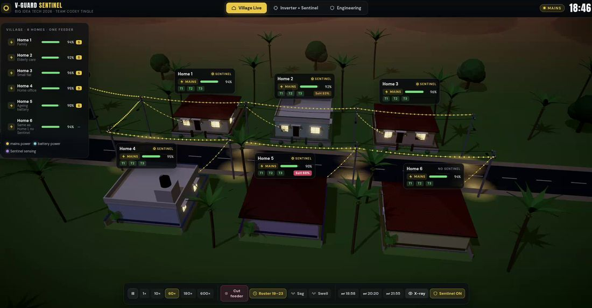 18:45, dusk, six homes, gold flow on the lines, windows lit | "Now zoom out to a Kerala village: six homes on one feeder. Home 1 and Home 6 are identical, with the same 150 amp-hour battery and the same appliances. Only Home 1 has Sentinel. Home 5 has an ageing battery at 68 percent health." |
| **0:03–0:06** | 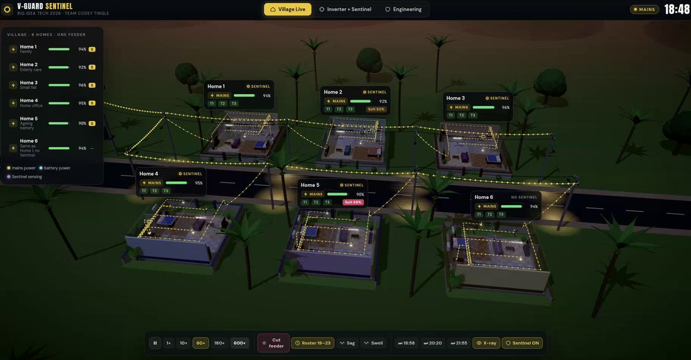 **X-ray**: roofs lift, the interiors and wiring are visible | "With the roofs off you can see every appliance, and the wiring back to each house's inverter corner." |
| **0:08–0:10** ⏸ | 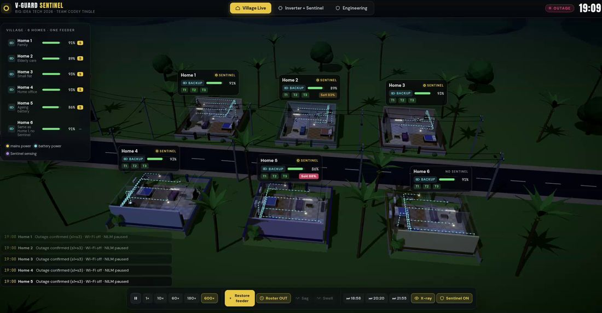 **19:05 OUTAGE**, flows cyan, street lights off; the ticker shows "Outage confirmed (s1+s3)" for every Sentinel home | "Seven o'clock: the scheduled load-shedding roster starts. Every inverter switches to battery, and every Sentinel home confirms the outage within two seconds, with no internet." |
| **0:12–0:17** | 19:18–19:39, SoC bars falling (irons running 19:15–19:35) | "Evening loads: fans, TVs, and the iron in three homes. Batteries drain fast." |
| **0:18** ⏸ | 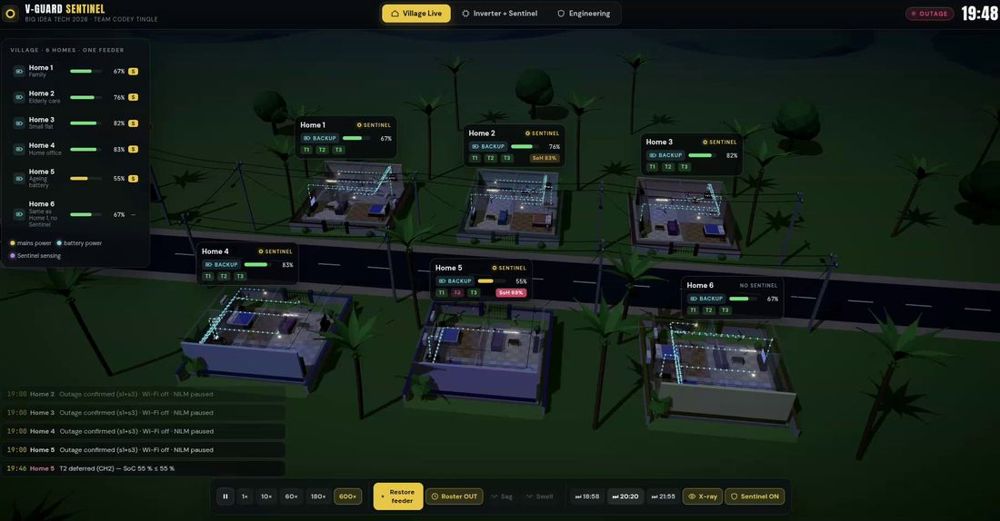 **19:48 · Home 5 T2 deferred** | "The ageing battery hits 55 percent first, so Home 5 defers its fans and TV. This is why battery health matters: a weak battery needs to protect its essentials earlier." |
| **0:20–0:22** ⏸ | 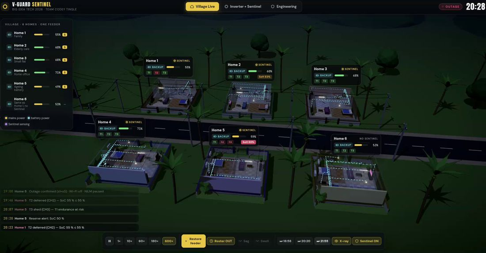 20:07 Home 5 **T3 shed · 'T1 endurance at risk'**; 20:23 Home 1 **T2 deferred** | "Home 5 then sheds its heavy sockets even above 40 percent, because Sentinel calculated that the remaining energy wouldn't carry the fridge and router through the expected outage. That's the hard floor. At 8:23 Home 1 defers its fans." |
| **0:24–0:26** ⏸⏸ | 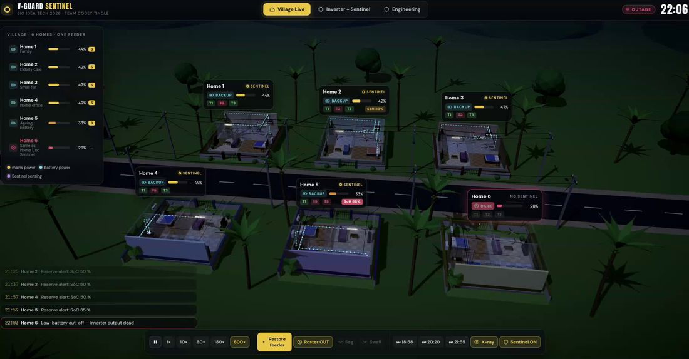 22:00 → **22:06: Home 6's badge turns red · DARK**; ticker "22:03 Home 6 Low-battery cut-off" | "Three minutes past ten. Home 6, same battery and same appliances but no Sentinel, just went dark. Fridge, Wi-Fi, lights, all gone for the next hour. **(pause)** Home 1 next door still has its fridge, router and hall light on." |
| **0:28–0:32** |  22:16–22:24, Home 1 on battery at ~41 %, Home 6 dark | "Same outage, same battery. The only difference is Sentinel deciding what matters. Home 1 kept its essentials running the whole four-hour outage." |

**Close the demo** (back to slide 13): *"So that's the prototype: the millisecond hardware behaviour on the bench, and the decision logic at village scale. Now let me be precise about what is proven and what isn't."*

---

## Path C · videos + one live click (≈ 2 min)
1. Play Video 2 (village) with the narration above, about 45 s with pauses.
2. Play Video 1 (bench) with narration, about 45 s.
3. Switch to `Sentinel-Live.html` → Inverter + Sentinel → switch the iron on → drag SoC to 38 % → **Reset MCU**: *"And here it is live: I crash the processor. Every coil drops, every load comes back. Coil off means load on. That's hardware, not software."* (≈ 20 s)

---

## Path A · live cues (short version to keep beside the laptop)
```
VILLAGE (180×) ─ ⏭18:58 → 19:00 cyan · street lights off
  └ Home 1 → Power corner → B1 · X1 · S · X4 · X7 · vote s1+s3
  └ ⏭20:20 → T2 deferred (bedroom dark) · fridge/router/light on
  └ ✕ → ⏭21:55 → 22:03 Home 6 DARK · Home 1 lit
  └ Home 1 → Reset MCU → all back → re-shed after reboot
BENCH ─ Iron ON → MAINS MCB → slow-mo: relay · scope gap · +0/+8/+1500 ms
  └ SoC 38 % → CH3 red, iron cold; fan deferred
  └ Reset MCU → all back, charger → factory
  └ Verify chain → Alter one byte → ✗ broken → Undo
```

## Timing guard
- If you are behind at the demo hand-off (clock past **4:30**), use **Path B** or cut the bench part to "MCB + Reset".
- Hard stop the demo at **8:10** and go to slide 13, whatever happens. Say: *"We'll happily show more during questions."*
