# 04 · Slide-by-slide defence report: `finalppt/VGuard_CodeyTingle.pptx`

> For each of the 17 slides: **what's on it → what to say → where every number comes from → how the graph/diagram was made → the questions it invites**.
> Timing plan: slides 1–11 ≈ 4 min · demo ≈ 4 min · slides 13–17 ≈ 2 min. Q&A follows (10 min).
> ⚠️ Housekeeping before the finale: slide 16's footer page number reads **"20"** (left over from the appendix numbering). Change it to 16 in PowerPoint, or delete the number.

---

## Slide 1 · Title (0:00–0:20)

- **Say:** "Good morning, we're Team Codey Tingle. In ten minutes: the idea, the working prototype live, and what's proven and what isn't."
- **Visual:** the right panel is a real screenshot of our Village simulation during the outage (Homes 2, 3, 5, 6).
- **Tagline logic:** "The inverter already knows when the power goes" (it has mains sense and switches in < 10 ms). "Sentinel teaches it what to keep on" (the autopilot) "and when its battery will quit" (SoH/RUL).
- **Likely Q:** none. Just set the tone.

---

## Slide 2 · The hook: "10:03 pm. The battery dies — with no warning." (0:20–0:50)
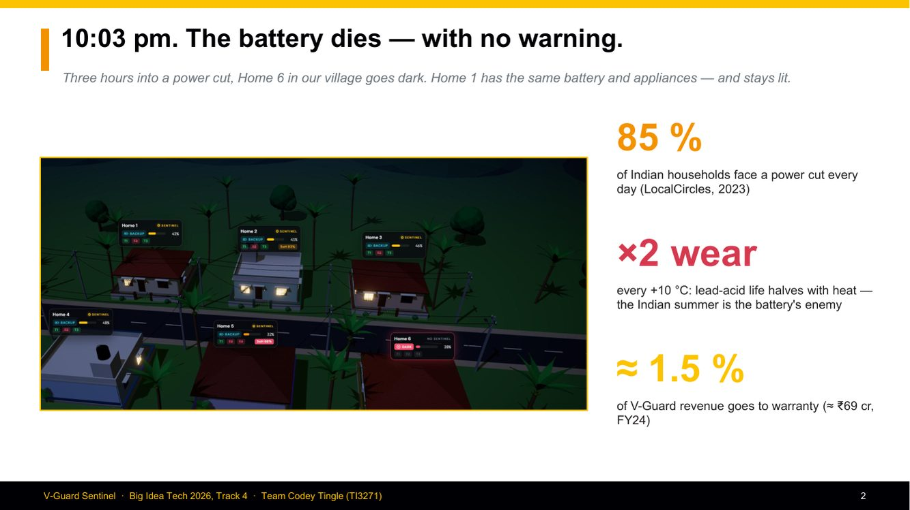
- **Picture:** Village simulation at ~22:10. **Home 6's badge is red (DARK)**; the others show BACKUP. It comes from the engine run, not a drawing.
- **Why 10:03 pm?** In our engine, Home 6 (no Sentinel, 150 Ah, SoH 93 %, family loads) hits the 20 % low-battery cut-off at 22:03 during the 19:00–23:00 roster outage.

| Number | Source | Defence |
|---|---|---|
| **85 %** of households face a cut every day | LocalCircles 2023, 25 k+ responses (round-2 research-market.md) | survey, self-reported; supporting data: 37 % face 2–8 h/day; rural evening supply 5–11 pm averages only ~4.7 h (PRAYAS); CEEW: 1 in 3 homes has a blackout/low-voltage/damage event each month |
| **×2 wear per +10 °C** | Arrhenius rule for lead-acid (Battery University BU-806a); design/02 uses AF = exp(6400·(1/298 − 1/T)), which doubles per ≈10 °C | the literature rule of thumb; our model integrates it as "25 °C-equivalent days" |
| **≈1.5 %** of revenue on warranty (≈₹69 cr, FY24) | V-Guard Annual Report FY24: warranty ₹69.39 cr on ₹4,559.43 cr revenue = 1.52 % | company-wide warranty, not battery-only; our claim is that battery failure causes are *monitorable* |

- **Likely Qs:**
  - *"Is 85 % realistic? Official data says 22+ hours of supply."* → "Both are true. Feeder averages hide the evening collapse; the rural 5–11 pm window gets ~4.7 h. Outages cluster exactly when families use power."
  - *"How much of the 1.5 % is batteries?"* → "The annual report doesn't split it. Our point is qualitative: the reasons warranties get voided (dry-out, deep discharge, overcharge, heat) are exactly what Sentinel measures and signs."

---

## Slide 3 · "Sentinel turns a smart inverter into an intelligent one." (0:50–1:10)
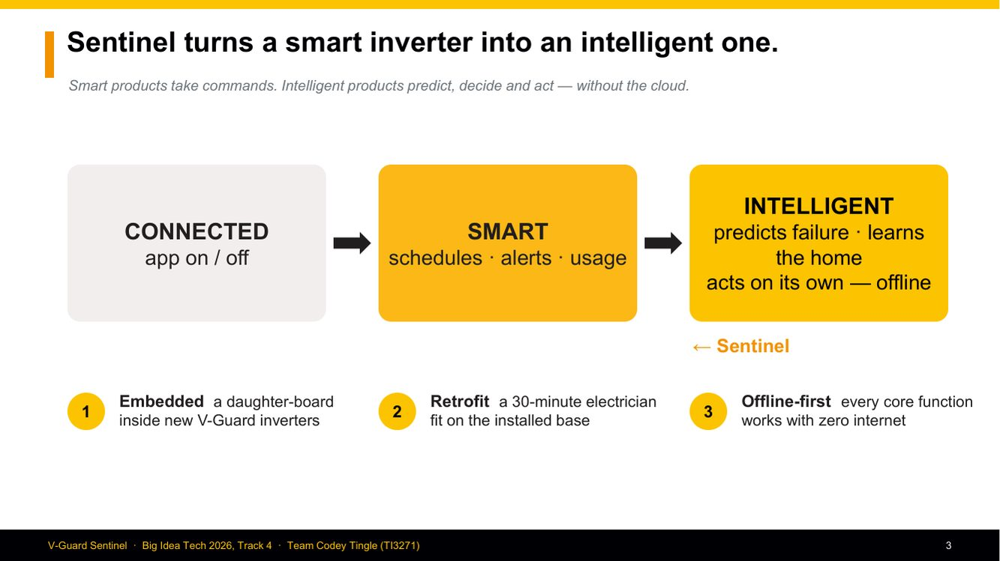
- **Connected → Smart → Intelligent** is the contest theme (Track 4: *From Smart Products to Intelligent Products*). Connected = app on/off. Smart = schedules, alerts, usage graphs (e.g. V-Guard Smart Pro + Smart 2.0 app). Intelligent = **predicts** (battery end of life), **decides** (which loads), **acts** (contactors, charger), **offline**.
- **The three ways it ships:** Embedded (daughter-board), Retrofit (30–45 min electrician fit; the slide says "30-minute", prototype/02 says 30–45 min), Offline-first.
- **Likely Q:** *"Isn't V-Guard's Smart Pro already intelligent?"* → "Smart Pro has Wi-Fi, BLE and an app with live status. There's no predictive layer: no remaining-life forecast, no autonomous load decisions. Sentinel-Embedded is designed to slot into exactly that platform."

---

## Slide 4 · "One small box reads the battery and switches the loads." (1:10–1:35)
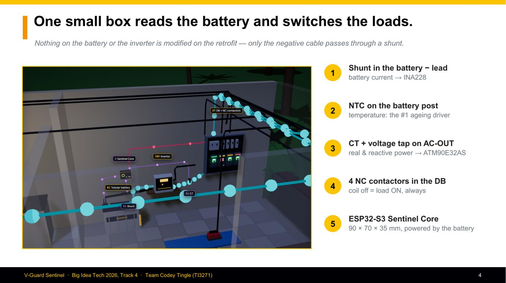
- **Picture:** the "Power corner" view of Home 1 (simulation), with tags B1, S, INV, X1, X4, X7. Cyan dots = battery power flowing (outage), violet = sensing lines, red = coil drive to the contactor.

| # | Item | Why it's there |
|---|---|---|
| 1 | Shunt in the battery − lead → INA228 | the only place all battery current passes; Kelvin mV only, the current never enters our PCB |
| 2 | NTC on the battery post | temperature = the #1 aging driver; the post tracks the electrolyte within ~2 °C |
| 3 | CT + voltage tap on AC-OUT → ATM90E32AS | a battery shunt can't see appliances while mains is on (D1); P, Q come from the output |
| 4 | 4 NC contactors in the DB | normally-closed = load ON if our coil is unpowered; any failure fails safe |
| 5 | ESP32-S3 core, 90 × 70 × 35 mm | vector instructions (ESP-NN), 512 KB SRAM, 16 MB flash, radio; powered from the battery |

- **Kicker defence:** "Nothing on the battery or inverter is modified on the retrofit — only the negative cable passes through a shunt." The added resistance stays < 0.2 mΩ, so the inverter's own low-battery sensing is unaffected (prototype/03 §2).
- **Likely Qs:** *"Is it safe for an electrician to cut the battery cable?"* → "It's the standard shunt install used by every battery monitor (Victron etc.). Torque per the shunt spec, fuse the sense lead at the battery end (2 A), and commissioning includes a 'power-off = loads on' check." · *"Why not a Hall sensor?"* → "Possible (ACS758); the shunt + INA228 has far lower offset, which matters for coulomb counting. A 10 mA bias would add up to Ah errors over days."

---

## Slide 5 · "Four jobs, one board" (1:35–1:50)
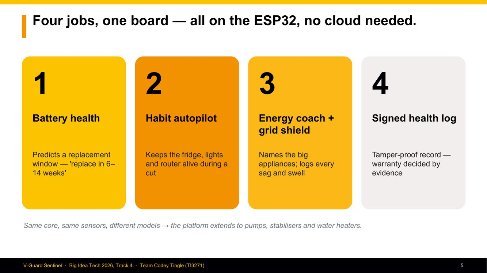
- The four engines: 1 battery health, 2 habit autopilot, 3 energy coach + grid shield, 4 signed health log.
- **Footer claim:** "Same core, same sensors, different models → pumps, stabilisers, water heaters." This is the round-2 platform roadmap (pumps: dry-run/bearing; stabilisers: PQ; geysers: predictive preheating). Keep it light; it's vision, not built.
- **Likely Q:** *"Where did federated learning go (Engine 4 in round 2)?"* → "We replaced it in the prototype with the signed health log, which is buildable and valuable now. Federated learning is fully designed (design 08) but we deliberately cut it (decision D15). And we'd federate the appliance model, not battery health, because that's where the device has labels."

---

## Slide 6 · Engine 1: "A window, not a date: 'replace in 6–14 weeks'" (1:50–2:25)

**The chain (left to right):**
1. **1 Hz sensing** of I, V, T (INA228 + NTC).
2. **Kalman filter** → SoC and R_int (3-state EKF: SoC, polarisation V1, R0; 1-RC Thevenin).
3. **14 + 6 features per outage cycle**: resistance/sag ratios vs the battery's own baseline, throughput, depth of discharge, heat stress, coulombic efficiency, charge acceptance, dQ/dV, plus 6 statics.
4. **int8 CNN × 3**: ~28 k parameters (27,990 trained), ~106 k MACs, 16 KB tensor arena; 3 seeds averaged.
5. **Grade**: quantile band + conformal → Healthy / Degrading / Replace within N weeks.

**The graph (bottom left):** produced by our own evaluation code (`deck/make_assets.py`, `model/evaluate.py`) on **3 independent test batteries** (0_b, 3_b, 6_a) that were never used for training, selection or calibration. X-axis = outage cycle. Dashed black = true SoH from the simulator. Orange = predicted P50. Yellow = P10–P90 band after conformal calibration. Red dotted = 80 % end of life.

**How to read it honestly:** the P50 is flat-ish and misses the steep drops (battery 6_a), but the **band contains the truth**. That is what "calibrated but wide" means: coverage 0.99, width ~34 points. This is a small, synthetic dataset (16 batteries, 624 cycles); the real fix is data.

| Number | Source |
|---|---|
| **8.2 pt** SoH MAE (RMSE 9.6) | `model/artifacts_sim/metrics.json`, 3 held-out batteries |
| **+0.01 pt** float → int8 | `quantization_report.json`: ΔMAE = 0.0128 |
| 28 k params · 16 KB | design/02 §2.2–2.3; trained model 27,990 params |
| "6–14 weeks" | the Replace grade's RUL window P10–P90 (fixture step 4); "plan for 6" = P10 |

- **Likely Qs:** *"8.2 points is bad."* → "Yes, on purpose we show it. It's synthetic data with only 16 batteries; the target after the aging campaign is ≤ 3 points. The architecture, quantisation and calibration are proven; the accuracy needs real tubular data, which nobody has publicly, which is Gate 1." · *"Why not LSTM/GRU?"* → see Q&A bank §C. · *"How do you get ground truth in the field?"* → "Rare deep outages from full to cut-off give a real capacity sample, used for on-device conformal re-anchoring, never for training on the device."

---

## Slide 7 · Engine 2: "Same outage, same battery: only Home 1 keeps its fridge on." (2:25–3:00)

**This is a native PowerPoint line chart built from our simulation engine's output** (`submission_v2/deck-v2/trace.json`, exported from `sentinel-live/src/sim/engine.js`, 5-minute samples 18:20–23:30).
- **Orange** = Home 1 (with Sentinel). **Black** = Home 6 (no Sentinel). Dashed lines at **55 % (T2 defer), 40 % (T3 shed), 20 % (cut-off)**.
- **Why the curves are identical until 20:24:** same battery (150 Ah, SoH 93 %), same appliances, same schedule. They split only when Sentinel acts.
- **Why Home 1's slope flattens after 20:24:** fans, TV and room lights (≈208 W) are deferred, so the load drops to the essentials (fridge 120 W when running, router 10 W, tube 20 W). A shallower slope means the battery lasts longer.
- **Why Home 6 goes flat at exactly 20 %:** that's the inverter's low-battery cut-off (S4), so there is zero output. It rises a little after 23:00 because mains returns and bulk charging starts.
- **Callouts:** 8:24 pm T2 deferred · 10:03 pm Home 6 cut-off · 10:37 pm Home 1 sheds T3 at 40 %.
- **57 min** = Home 6 dark from 22:03 to 23:00. **0 min** = Home 1's fridge, router and hall light were never unpowered when demanded.
- **Bottom right:** the fail-safe line: NC contactors + supervisory timer + medical jumper.

**Defence of the thresholds** (design/05 §4.2): 40 % T3 matches lead-acid guidance ("don't routinely go below 40–50 %"); T2 at 55 % acts before T3 is urgent; 15-point hysteresis (restore at 55/70) prevents chatter; min dwell 3–5 min protects compressors; 60 s re-evaluation.

- **Likely Qs:** *"Isn't this just a timer/threshold? Where's the AI?"* → "The shedding is deliberately deterministic; safety logic must be auditable. The intelligence is upstream: the Kalman-filtered SoC it acts on, the learned hour-of-week load and outage tables that set the endurance floor, and the battery-health model that tells a weak battery to protect essentials earlier (Home 5 sheds at 19:46, Home 1 at 20:24)." · *"What if the family wants the fan?"* → "30-minute override (max 4 h), logged, and it can't beat the hard floor." · *"Why not run until 20 %?"* → "Deep discharge sulphates lead-acid; the ladder protects the essentials *and* the battery's life."

---

## Slide 8 · Engine 3: "One sensor saves energy and catches a misbehaving grid." (3:00–3:25)

**Left graph (Energy Coach):** generated by running **our own `nilm/event_detector.py`** on a 3-hour synthetic home from `nilm/appliance_sim.py` (seed 7). The black line is whole-home real power (kW). **Orange lines = switch-ON events, gold = switch-OFF**, detected by the algorithm (123 events).
- **Important label defence:** the y-axis says *whole-home power* (up to ~6 kW). That's the optional mains CT (X6) view; the inverter output alone is ≤ ~800 W. We corrected this label from the older deck.
- Metrics (prototype/00): event recall 1.00, precision 0.74, **fridge F1 0.97, iron 1.00**, mixer 0.86, geyser 0.77, 87 % of energy assigned, on synthetic streams.

**Right graph (Grid Shield):** generated by **our own `pq/pq.py`** on a synthetic 230 V, 50 Hz wave sampled at 4 kS/s, with a 120 ms sag to 0.55 pu and a 100 ms swell to 1.15 pu injected. Black = half-cycle RMS (what Sentinel measures). Yellow band = normal 0.9–1.1 pu.
- The detector reported **SAG 0.543 pu, 120 ms** and **SWELL 1.165 pu, 100 ms** → the slide says "0.54 / 1.16". Errors ≈0.7 % / 1.5 % of nominal, within our validation target of ≤ 2 % (design/11). On the full dip test set: **13/13 detected, magnitude error ≤ 0.86 %**, duration error 0 half-cycles.

- **Likely Qs:** *"NILM accuracy in real homes is poor."* → "Agreed for small loads. We scope it to big appliances (fridge, AC, geyser, pump, iron); benchmarks give 0.65–0.89 F1 there, and each home learns from one user label. Anything uncertain stays 'unknown'." · *"Why can't you predict sags?"* → "Grid sags propagate instantly; there's no local precursor. We detect in a half-cycle and create evidence, and we say so." · *"Class A?"* → "No, Class-S-like. We never claim certified Class A."

---

## Slide 9 · "Inside the inverter, Sentinel taps what's already there." (3:25–3:45)
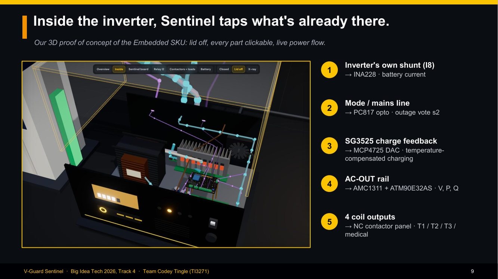
**Picture:** the Inverter + Sentinel tab, "Inside" view, lid off. You can see the transformer (I5), MOSFET heatsink (I4), fan (I10), control board (I3), the transparent relay (I2), the front panel (I11) and **our board on gold standoffs**.

| # | Tap | Sentinel part | Purpose |
|---|---|---|---|
| 1 | the inverter's own shunt (I8) | INA228 (C3) | battery current without an external shunt |
| 2 | mode / mains line | PC817 opto (C12) | outage vote s2 |
| 3 | SG3525 charge feedback node | **MCP4725 DAC (C13)** | temperature-compensated charging: Embedded only, hardware clamp, 2 s heartbeat revert |
| 4 | AC-OUT rail | AMC1311 (C5) + ATM90E32AS (C6) | V, P, Q, sag/swell |
| 5 | 4 coil outputs | ULN2003 (C7) | NC contactor panel T1/T2/T3/MED |

- **Likely Qs:** *"Injecting into the SG3525 feedback: isn't that dangerous?"* → "It's an offset around the factory divider, bounded by a hardware clamp the software can't exceed, and a 2-second heartbeat returns it to factory if Sentinel dies. It needs V-Guard's charger schematic and a Tier-2 bench validation, which is exactly our ask." · *"Does every V-Guard inverter have an internal shunt?"* → "Not guaranteed; prototype/01 notes the current-sense topology varies. Where it's absent, the Embedded board uses the same external-shunt input as the Retrofit."

---

## Slide 10 · "Designed to be built: 90 × 70 × 35 mm, HV zone fenced off." (3:45–4:00)
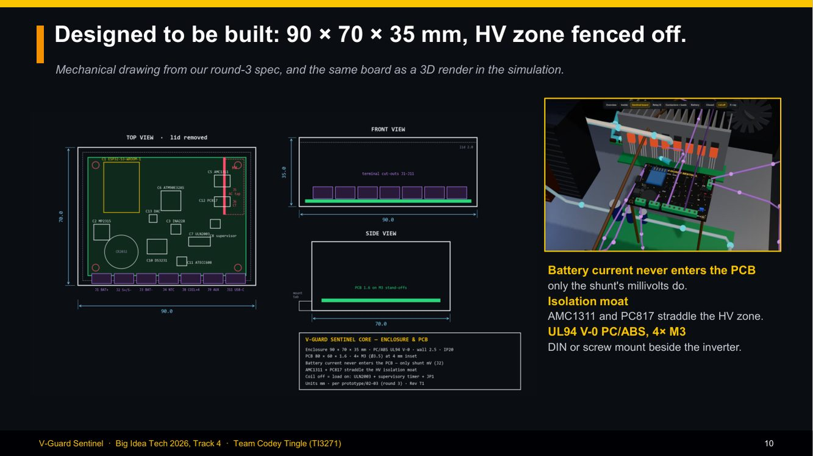
**Left:** our mechanical drawing (`deck-v2/cad.py`), drawn from the round-3 spec (prototype/02–03): top view with C1–C14 placement, the J1–J11 connector row, 4× M3 holes, and a **red HV zone behind an isolation moat**; front view with terminal cut-outs; side view with PCB standoffs; title block. **Right:** the same board rendered in 3D in the simulation.
- **Why the AMC1311 and PC817 sit on the moat:** they are the isolation devices. Their two sides live in different voltage domains, so they must straddle the barrier.
- **The older AutoCAD file** (`prototype/cad/*.dxf`, round 2) shows "MCU + NPU" and 2 relay drivers; the round-3 design supersedes it (D16: no NPU claim; 4 coil channels).
- **Likely Qs:** *"Creepage/clearance?"* → "Layout target ~8.5 mm across the moat for reinforced isolation (from the SIM-R2 parameters); final values need standards review, stated as open." · *"Why UL94 V-0?"* → "Flame-retardant plastic next to a battery and mains; it's the standard for electronics enclosures."

---

## Slide 11 · "And this is exactly how the bench is wired." (4:00–4:10)
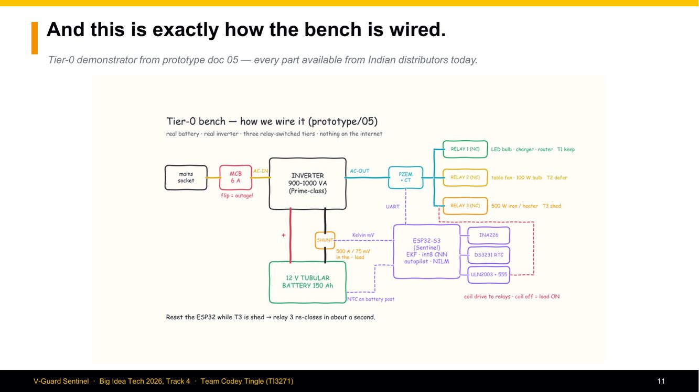
**Hand-drawn-style sketch** (`deck-v2/sketch.py`) of the **Tier-0 bench** from prototype/05 §1:
- mains socket → **6 A MCB** ("flip = outage!") → inverter AC-IN
- inverter AC-OUT → **PZEM-004T + CT** (a Tier-0 stand-in for the ATM90E32AS) → 3 **NC relays**: T1 (LED bulb, charger, router), T2 (table fan + 100 W bulb), T3 (500 W iron/heater)
- 12 V 150 Ah tubular battery; **shunt 500 A / 75 mV in the − lead** → Kelvin mV → ESP32 (via **INA226**, because INA228 breakouts aren't sold in India)
- NTC on the battery post; DS3231 RTC; ULN2003 + 555 supervisory timer → coil drive
- "Reset the ESP32 while T3 is shed → relay 3 re-closes in about a second."
- **Why PZEM at Tier 0?** It's available in India for ₹799–999; its limits (1 Hz, no harmonics, no inrush) are stated in prototype/05.
- **Likely Q:** *"Have you built this?"* → "The bench is specified to the part and priced from Indian distributors (₹25–35 k including the battery and inverter). The code that would run on it is built and tested on host. Flashing and wiring is Tier 0, days of work, and it's in our ask."

---

## Slide 12 · Demo hand-off (4:10–8:10)
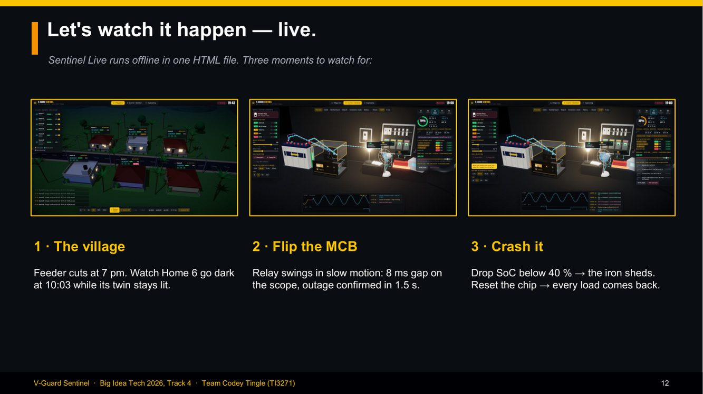
Three screenshots: 1 the village during the outage · 2 the bench during the MCB transfer (slow-mo scope) · 3 the bench after the MCU reset. **Use the scripts in [03-Demo-Video-Notes.md](03-Demo-Video-Notes.md).**
- "1.5 s" = s1 debounce (design/05 §7 allows 1–2 s). "8 ms" = V-Guard Prime transfer < 10 ms (spec sheet); the sim uses 8 ms.

---

## Slide 13 · "What's proven, what's synthetic, and what still needs hardware." (8:10–8:40)
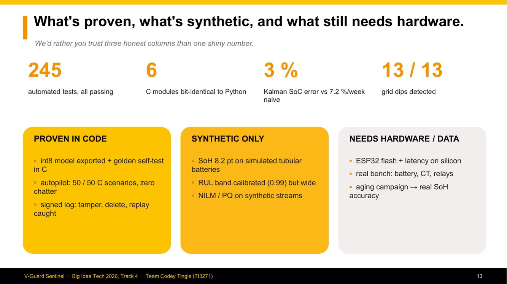
| Number | Source | Exact meaning |
|---|---|---|
| **245** automated tests | `pytest --collect-only` = 224 without torch + 21 model tests; per module: autopilot 65, charger 48, health log 31, dashboard 19, model 21, datasets 12, features 12, sim 11, firmware host 7, NILM 6, PQ 6, EKF 5, leakage 2 | all pass on the team's machine (the crosswalk's older "176" predates the charger and dataset tests) |
| **6** C modules | EKF, autopilot, NILM, PQ, health log, charger: C99 ports with host tests | matched to Python (autopilot scenario parity, charger byte parity, NILM/PQ bit-identical, health-log cross-verified) |
| **3 %** vs 7.2 %/week | `ekf/README`: EKF SoC RMS ≈ 3.0 % vs a naive counter drifting ≈ 7.2 %/week (4 simulated days, seed 1) | simulated battery |
| **13 / 13** | PQ dip test set | synthetic waveforms |

Columns: **Proven in code** (int8 export + golden self-test in C; autopilot 50/50 C scenarios, zero chatter; signed log catches tamper/delete/replay) · **Synthetic only** (SoH 8.2 pt; RUL band 0.99 coverage but wide; NILM/PQ on synthetic streams) · **Needs hardware/data** (ESP32 flash + latency; real bench; aging campaign).
- **Say:** "We'd rather you trust three honest columns than one shiny number."
- **Likely Q:** *"So nothing runs on real hardware?"* → "Correct, and we say it. What's proven is that the exact C code that would run on the ESP32 links, runs, passes a bit-exact int8 self-test, and produces the dashboard state, on a host build. Flashing a DevKit is the next step and needs only the parts."

---

## Slide 14 · "Two SKUs, one board — 5–14 % of one battery's price." (8:40–9:05)
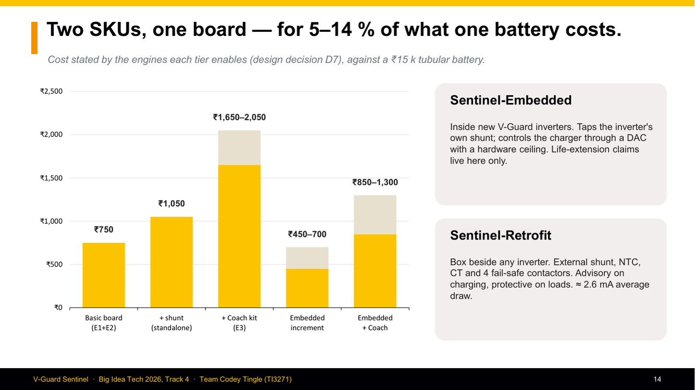
**Native chart** from decision D7 (design/12): gold = the "from" price, beige = the range up to.

| Tier | Price | What it enables |
|---|---|---|
| Basic board (E1+E2) | ₹750 | battery health + autopilot, with RTC, secure element, supervisory timer |
| + shunt (standalone Retrofit) | ₹1,050 | adds the 500 A shunt |
| + Coach kit (E3) | ₹1,650–2,050 | adds AFE + CT + tap + isolator (+₹600–1,000) |
| Embedded increment | ₹450–700 | inside a new inverter (reuses its rail, shunt, enclosure) |
| Embedded + Coach | ₹850–1,300 | — |

- **5–14 %** = ₹750 ÷ ₹15,000 = 5 % … ₹2,050 ÷ ₹15,000 = 13.7 %. **Contactors are extra** (₹1,050–1,100 each branded; ₹183 for a 4-ch relay module at the bench).
- **Likely Qs:** *"Will customers pay?"* → "The retrofit sells as 'your fridge stays on and you know when to replace the battery'; the embedded one as a premium tier. For V-Guard the bigger value is timely battery replacement sales and cheaper warranty resolution." · *"BOM at volume?"* → "These are indicative component costs from Indian distributors; volume pricing would be lower, but we haven't claimed a number."

---

## Slide 15 · "Three validation gates — and what we need to pass the first." (9:05–9:35)
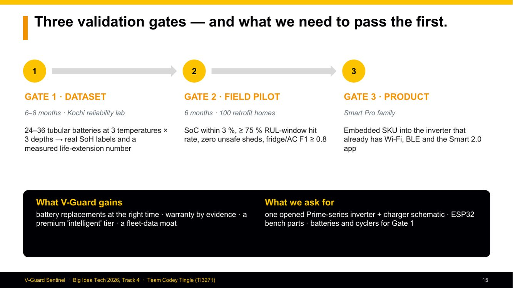
| Gate | Plan (design/04, design/11) | Pass criteria |
|---|---|---|
| **1 · Dataset** | 24–36 tubular batteries, 2 brands, 100/150/200 Ah, **27/40/50 °C × DoD 30/50/80 % × full vs partial-SoC**, 6–8 months in the Kochi reliability lab, reference test every 25 cycles, teardown of ≥ 6 end-of-life units | EKF tables, real SoH labels, measured life extension (fixed vs compensated charging at 40 °C) |
| **2 · Field pilot** | 100 retrofit homes × 6 months | SoC RMS ≤ 3 %, ≥ 75 % RUL-window hit rate, zero unsafe sheds, fridge/AC F1 ≥ 0.8, < 1 % OTA failures, power within budget |
| **3 · Product** | Embedded SKU in the Smart Pro family (already has Wi-Fi, BLE, Smart 2.0 app) | 3 model releases with no regression |

- **Ask:** one opened Prime-series inverter + charger schematic · ESP32 bench parts · batteries and cyclers for Gate 1.
- **Likely Q:** *"Why 'gates, not dates'?"* → "Because every claim should be unlocked by evidence. If Gate 1 shows the model can't beat 3 points, we don't ship the prediction; the autopilot and log still ship."

---

## Slide 16 · Appendix: safety and standards (Q&A backup)
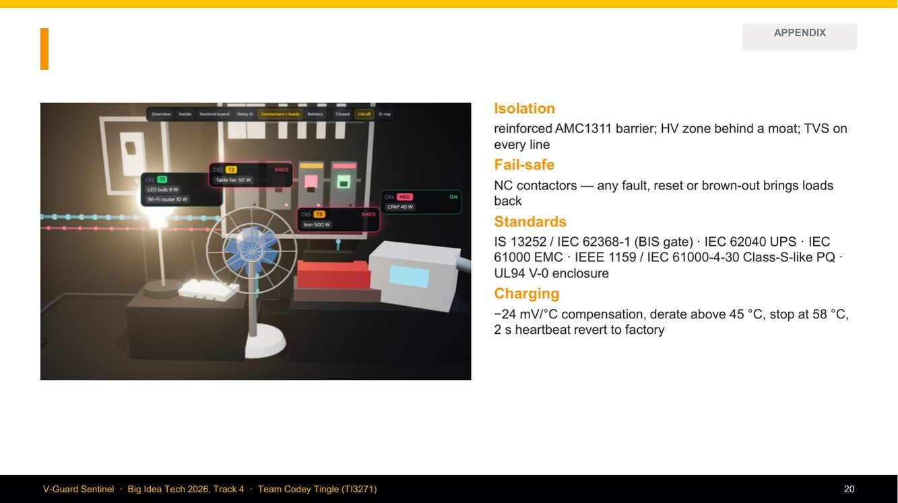
| Item | Detail |
|---|---|
| Isolation | reinforced AMC1311 barrier; HV zone behind a moat; TVS on every external line |
| Fail-safe | NC contactors: any fault, reset or brown-out brings the loads back |
| Standards | **IS 13252 / IEC 62368-1** (the BIS gate for IT/AV electronics) · IEC 62040 (UPS) · IEC 61000 (EMC; -4-11 dips for testing, -4-30 PQ methods) · IEEE 1159 (PQ event classes) · UL94 V-0 enclosure |
| Charging | −24 mV/°C compensation, derate above 45 °C, stop at 58 °C, 2 s heartbeat revert to factory |
- **Likely Q:** *"Certified?"* → "No. These are the standards we design to; certification is after the PCB (Tier 1)."

---

## Slide 17 · Close (9:35–10:00)
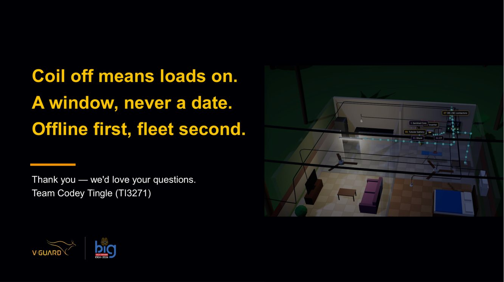
- **Coil off means loads on**: it fails safe. **A window, never a date**: honest uncertainty. **Offline first, fleet second**: it works in the village before it talks to the cloud.
- Background: Home 1's x-ray interior (simulation).
- End cleanly: "Thank you, we'd love your questions." Then stop talking.

---

## Numbers to have at your fingertips (from this deck)
`85 %` · `×2 per +10 °C` · `1.52 % / ₹69.39 cr FY24` · `< 10 ms transfer (8 ms in the sim)` · `1.5 s outage confirm` · `55 / 40 / 20 %` · `restore 55 / 70 %` · `3–5 min dwell · 60 s re-eval` · `28 k params · 106 k MACs · 16 KB arena · ~32 KB ML RAM` · `3 seeds × 36.7 KB` · `8.2 / 9.6 pt` · `+0.013 pt int8` · `0.66 → 0.99 coverage, 34 pt width` · `3 % vs 7.2 %/wk` · `123 events · F1 0.97 fridge` · `0.54 / 1.16 pu` · `13/13 dips · ≤ 0.86 %` · `245 tests · 6 C modules` · `₹750 → ₹2,050 · 5–14 %` · `≈2.6 mA` · `90 × 70 × 35 mm · PCB 80 × 60` · `−24 mV/°C · 45 °C derate · 58 °C stop` · `24–36 batteries · 100 homes`
