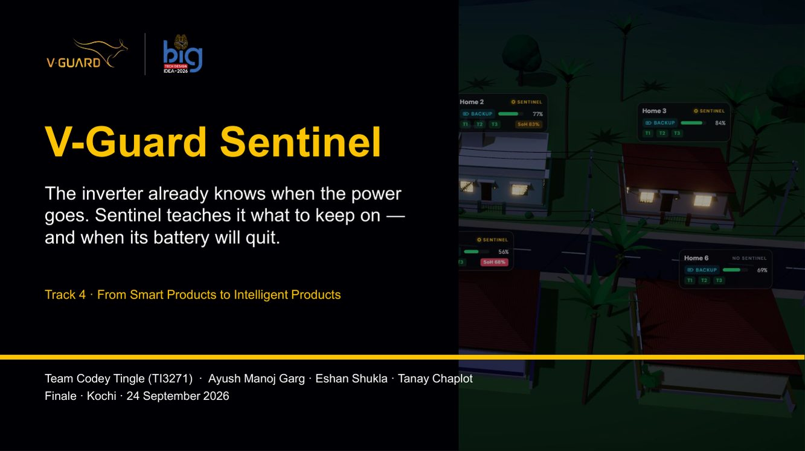

# Finale preparation: V-Guard Sentinel · Team Codey Tingle (TI3271)

> Kochi finale · **10 min presentation + demo, then 10 min questions.**
> What we show: `finalppt/VGuard_CodeyTingle.pptx` → `Sentinel-Live.html` (or `demoVideo/demo*.mp4`).

## The study pack
| # | File | Read it for | Time |
|---|---|---|---|
| 1 | [01-Project-Explained.md](01-Project-Explained.md) | every part of the project in plain words, with the logic and source behind each claim; why competitors haven't done it; what we uniquely bring | 60 min |
| 2 | [02-Simulation-Guide.md](02-Simulation-Guide.md) | every button, panel, colour and number in the simulation, with numbered UI maps; demo routes; troubleshooting | 30 min + practice |
| 3 | [03-Demo-Video-Notes.md](03-Demo-Video-Notes.md) | live vs video decision; second-by-second narration for both videos; the hybrid path | 15 min + rehearse |
| 4 | [04-Slide-by-Slide-Defence.md](04-Slide-by-Slide-Defence.md) | each of the 17 slides: what to say, where every number comes from, how every graph was made, likely questions | 45 min |
| 5 | [05-QA-Bank.md](05-QA-Bank.md) | ~100 engineering questions in 14 categories with short answers, deeper layers and trap questions | 90 min, then drill each other |

---

## How we are scored → what wins each block
| Criterion | Marks | What wins it | Where we prepared it |
|---|---|---|---|
| Clarity & substance of presentation | 10 | one idea per slide, a story (Home 1 vs Home 6), sentence headlines, honest numbers | slide notes in the PPT + [04](04-Slide-by-Slide-Defence.md) |
| **Ability to respond to questions** | **15** | answer first, name the mechanism, separate proven / synthetic / planned, admit limits and pivot to the gate | [05](05-QA-Bank.md) + [01](01-Project-Explained.md) |
| **Proof of concept (even a sample sketch)** | **15** | live simulation (bench + village), 3D inverter cutaway with the Sentinel board, CAD sheet, bench wiring sketch, 245-test codebase | [02](02-Simulation-Guide.md) + [03](03-Demo-Video-Notes.md) + slides 9–12 |

---

## Run of show (10:00)

| Slide | 1 | 2 | 3 | 4 | 5 | 6 | 7 | 8 | 9 | 10 | 11 | **12 demo** | 13 | 14 | 15 | 17 |
|---|---|---|---|---|---|---|---|---|---|---|---|---|---|---|---|---|
| Seconds | 20 | 30 | 20 | 25 | 15 | 35 | 35 | 25 | 20 | 15 | 10 | **240** | 30 | 25 | 30 | 25 |

**Checkpoints:** start the demo by **4:10** · leave the demo by **8:10** · "Thank you" by **10:00**. Slide 16 (safety appendix) is **skipped in the talk** and used only in Q&A.

---

## The 30-second story (everyone should be able to say this)
> "Every Indian home inverter switches in under 10 milliseconds, but its battery is completely blind. Nobody knows how much is left or when it will die, so at 10 pm in a long cut it dies and takes the fridge and Wi-Fi with it. **Sentinel** is a ₹750–2,000 ESP32 board that measures the battery and the inverter output, runs a Kalman filter and a tiny int8 network *on the chip*, and acts through fail-safe contactors: it keeps the essentials alive, warns 'replace within 6 to 14 weeks', logs grid events and signs everything for warranty. All offline. In our village simulation, identical Home 6 without Sentinel goes dark at 10:03 pm; Home 1 keeps its fridge on until mains returns."

## The 10 numbers to know cold
| | | | |
|---|---|---|---|
| **< 10 ms** inverter transfer | **1.5 s** outage confirm (2-of-3) | **55 / 40 / 20 %** T2 / T3 / cut-off | **57 min** Home 6 dark vs 0 min Home 1 |
| **28 k params** int8 CNN × 3 · 16 KB | **8.2 pt** SoH MAE (synthetic) · **+0.013** int8 | **3 %** EKF vs **7.2 %/wk** naive | **245 tests** · 6 C modules |
| **₹750 → ₹2,050** retrofit · 5–14 % of a battery | **≈2.6 mA** average draw | | |

## The three phrases (the closing slide)
**Coil off means loads on** (fail-safe) · **A window, never a date** (honest uncertainty) · **Offline first, fleet second** (works in the outage).

---

## Suggested roles (edit to fit the team)
| Person | Presents | Owns in Q&A |
|---|---|---|
| Speaker A | slides 1–5 + 13–17 | problem, market, business, competition, roadmap (Q&A §A, L, M) |
| Speaker B | slides 6–8 | battery science, ML, NILM/PQ (§B, C, D, G) |
| Speaker C | slides 9–12 + drives the demo | hardware, firmware, safety, charging, security, simulation (§E, F, H, I, J, K) |

Rule: one person answers; if they're stuck, they say "my teammate built that part" and hand over. No two people answering at once.

---

## Night-before checklist
- [ ] Open `Sentinel-Live.html` **on the venue/presentation laptop**; run the full demo route once; confirm it's smooth at 180× (else use 60×).
- [ ] Laptop on mains power, battery-saver OFF, notifications OFF, screen never sleeps.
- [ ] Copy **PPT + PDF + HTML + both MP4s** to the laptop *and* a USB stick.
- [ ] PowerPoint in Presenter View so the notes are visible; slide 16's footer number fixed ("20" → "16").
- [ ] Rehearse with a timer twice: once with the live demo, once with the videos (Path B).
- [ ] Each person drills their Q&A categories; a teammate fires random questions from [05](05-QA-Bank.md) for 10 min.
- [ ] Know where these are if a judge asks: `design/12` (17 decisions), `prototype/00` (status crosswalk), `prototype/code/run_all.sh` (reproduces every number).

## Source map (where everything lives in this repo)
| Topic | Where |
|---|---|
| Home electrical system, inverter states, V-Guard model facts | `prototype/01-Home-Electrical-System-and-Inverter-Basics.md` |
| Product definition, SKUs, connectors | `prototype/02` |
| Every part + placement | `prototype/03` |
| Firmware, TinyML on device | `prototype/04` |
| Bench build plan, demo script, prices | `prototype/05` |
| What's proven (status) | `prototype/00-Status-Crosswalk.md` |
| Battery estimation (EKF) | `design/01` · ML pipeline `design/02` · charging `design/03` · aging campaign `design/04` · autopilot `design/05` · NILM `design/06` · PQ `design/07` · fleet `design/08` · security `design/09` · hardware/power `design/10` · validation `design/11` · **decisions `design/12`** · external review `design/13` |
| Code + tests | `prototype/code/` (sim, features, ekf, model, autopilot, nilm, pq, healthlog, charger, dashboard, firmware) |
| Deck sources, charts, CAD, sketch, sim trace | `submission_v2/deck-v2/` |
| Simulation source | `submission_v2/sentinel-live/` (thresholds in `src/sim/params.js`) |
